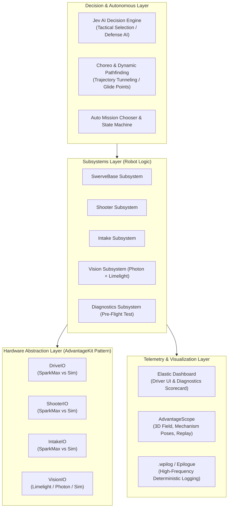

# 📐 2026–2027 Robot Software Architecture & System Design

Welcome to the technical architecture guide for Team 8334's 2026/2027 robot platform. This document outlines the system hierarchy, hardware abstraction layers, dual-vision platform, pre-flight diagnostics, and the Jev AI decision engine.

---

## 1. High-Level System Architecture Diagram

```
┌──────────────────────────────────────────────────────────────────────────┐
│                   DECISION & TACTICAL STRATEGY LAYER                     │
│  - Jev AI Decision Engine (TypeSafe System One: <20ms structured choices)│
│  - Choreo Trajectory Tracking & Dynamic Obstacle Avoidance               │
│  - Autonomous Mission Chooser & Teleop State Machine                     │
└────────────────────────────────────┬─────────────────────────────────────┘
                                     ▼
┌──────────────────────────────────────────────────────────────────────────┐
│                         SUBSYSTEM LOGIC LAYER                            │
│  - SwerveBase (Kinematics, Glide Points, Field-Oriented Drive)           │
│  - Shooter (Distance-to-RPM Dual Flywheel Tables, Kicker Control)        │
│  - Intake (Continuous ProfiledPID [0,360], Gravity Feedforward)          │
│  - Vision (Multi-Tag AprilTag Fusion: Limelight MT2 + PhotonVision)      │
│  - Diagnostics (15-Second Pre-Flight Self-Test Sequencer)                │
└────────────────────────────────────┬─────────────────────────────────────┘
                                     ▼
┌──────────────────────────────────────────────────────────────────────────┐
│                   HARDWARE IO ABSTRACTION (AdvantageKit)                 │
│         DriveIO         ShooterIO         IntakeIO         VisionIO      │
│        /      \         /       \         /      \         /      \      │
│    [Spark]  [Sim]   [Spark]   [Sim]   [Spark]  [Sim]   [LL/PV]  [PVSim]  │
└────────────────────────────────────┬─────────────────────────────────────┘
                                     ▼
┌──────────────────────────────────────────────────────────────────────────┐
│                     TELEMETRY & VISUALIZATION LAYER                      │
│  - Elastic Dashboard (Driver UI, Feature Switches, Pre-Flight Scorecard) │
│  - AdvantageScope (3D Field, Robot Poses, Mechanism Visualizer)          │
│  - Deterministic Replay (.wpilog Byte-for-Byte Match Simulation)         │
└──────────────────────────────────────────────────────────────────────────┘
```

---

## 2. Core Architectural Pillars



---

## 3. Subsystem Breakdown & Design Contracts

### A. Swerve Drive (`SwerveBase.java`)
- **Kinematics Engine**: Powered by YAGSL (Yet Another Generic Swerve Library) with custom high-speed heading correction and skew compensation.
- **Simulation**: Backed by `IronMaple` rigid-body 2D simulation for true carpet friction, wheel slip, and simulated bumper collision physics.
- **Navigation**: Integrated with `GlideConstants` for automated transit to strategic field zones (Hub, Feeders, Trenches).

### B. Dual-Flywheel Shooter (`Shooter.java`)
- **Velocity Control**: Independent PID + `SimpleMotorFeedforward` controllers for Left (CAN 12) and Right (CAN 11) flywheels with anti-windup voltage clamping (`[-1.5V, +1.5V]`).
- **Empirical Tuning Curves**: Interpolating distance lookup tables (`leftRpmTable` & `rightRpmTable`) providing tailored RPM curves and differential spin.
- **Kicker Feeder**: 12V pulse actuation sequenced strictly after flywheels reach stable speed within ±150 RPM tolerance.
- **3D Visualization**: Real-time 3D pose broadcast to `Subsystems/Shooter/ShooterPose3d` for AdvantageScope mechanism view.

### C. Articulated Ground Intake (`Intake.java` / `IntakeMechanism.java`)
- **Pivot Arm Control**: Trapezoidal motion profiling (`ProfiledPIDController`) with continuous `[0, 360]` angle wrapping.
- **Gravity Compensation**: `ArmFeedforward` calculation relative to horizontal mechanical position (`250°`).
- **States**: `Standby` (Up: 347°), `Intaking` (Down: 250°), `Down`, `Reversed`, `Manual`, and `Disabled`.
- **Jam Detection**: Integrated current monitoring with automatic reversal pulse if high-torque stalling occurs.

### D. Dual-Vision Platform (`Vision.java` / `LimelightHelpers.java`)
- **Front Camera**: Limelight 3/3G running MegaTag2 feeding raw gyro yaw rates (`DegreesPerSecond`) directly into pose estimation.
- **Side/Back Coprocessor**: Orange Pi 5 running PhotonVision with `PhotonPoseEstimator` (`MULTI_TAG_PNP_ON_COPROCESSOR`).
- **Desktop Simulation**: `PhotonCameraSim` and `VisionSystemSim` generating simulated AprilTag detections in SimGUI without physical cameras.
- **Object Detection**: YOLOv8 neural network pipeline running on the coprocessor NPU for automated game piece targeting ("Ball Hunt").

### E. Pre-Flight Diagnostics (`Test/Diagnostics.java` / `TestMode.java`)
- **15-Second Automated Pit Check**:
  1. *CAN Bus Audit*: Verifies all CAN devices acknowledge heartbeat.
  2. *Swerve Motor Pulse*: Spins each drive wheel at +1.5V to verify encoder velocity sign.
  3. *Steer Alignment Check*: Sweeps modules 90° to confirm absolute encoder correlation.
  4. *Intake Profile Check*: Verifies arm travel time and flags current draw > 25A (mechanical binding).
  5. *Shooter Ramping*: Ramps flywheels to 1500 RPM and checks steady-state error < ±30 RPM.
  6. *Vision Link Check*: Verifies stream FPS > 25 and network latency < 40ms.
- **Scorecard**: Displays a color-coded status grid on Elastic Dashboard before matches.

### F. Driver Haptic Feedback (`Devices/Controller.java` & `Teleop.java`)
- **Non-Blocking Sequenced Rumbles**: Tactile notification engine operating independently of robot control loops.
- **Rumble Patterns**:
  - `TARGET_LOCKED`: Double crisp pulse (100ms on, 80ms off, 100ms on) notifying driver and operator when the robot is aligned with the hub and flywheels are up to speed.
  - `BALL_ACQUIRED`: Confirmation pulse when game piece is seated in the hopper.
  - `HARDWARE_WARNING`: Rapid triple pulse alerting drivers when vision or sensor degradation occurs mid-match.
  - `MATCH_TIME_WARNING`: Sustained deep rumble warning drivers at T-30s and T-15s before match conclusion.

### G. Non-CLI Driver Alert Infrastructure (`Utils/Alert.java`, `Utils/AlertManager.java`, `Subsystems/LEDs.java`)
- **No Console Clutter**: Replaces spammy driver station console printouts with persistent visual indicators.
- **Elastic Dashboard Banner**: Color-coded single-line top banner (`Driver/AlertBanner`) and active tables (`Alerts/Errors`, `Alerts/Warnings`).
- **Addressable LEDs Integration**:
  - `STROBE_RED`: Critical hardware fault (disconnected encoder, motor stall).
  - `SOLID_ORANGE`: System warning / degraded sensor operation (vision lost, auto-clearing jam).
  - `SOLID_GREEN`: Target locked & ready to shoot.
  - `STROBE_GOLD`: Flywheels spinning up.
  - `SOLID_BLUE` / `SOLID_RED`: Default Alliance color.

### H. Sensor Redundancy & Graceful Degradation
- **Vision Watchdog (`SwerveBase.java`)**: Continuously monitors Limelight MegaTag2 latency and frame timestamps. Rejects stale packets (>150ms) and telemetry jumps (>1.25m). Automatically transitions to pure odometry dead-reckoning with driver alert pulse if camera feed degrades.
- **Intake Absolute Encoder Fallback (`Intake.java`)**: Monitors `DutyCycleEncoder.isConnected()`. If the absolute encoder fails or is unplugged, the intake seamlessly falls back to NEO internal relative encoder delta tracking (`3.6°` per motor rotation), preventing mechanical damage or mechanism lockup.
- **Current Stall Jam Clearning**: Monitors roller motor current (>30A for >0.5s) to detect mechanical jams, automatically reversing rollers to eject the obstruction without requiring driver intervention.

### I. Standardized Blue-Origin Coordinate Geometry (`Utils/AllianceFlipUtil.java`)
- **Single Source of Truth**: All field coordinates, waypoints, and target structures are defined once in Blue Alliance coordinates ($X=0$ at Blue wall).
- **Dynamic Field Mirroring**: Automatically transforms coordinates, rotations, and poses across the field midline ($X_{\text{red}} = 16.535 - X_{\text{blue}}$, $\theta_{\text{red}} = 180^\circ - \theta_{\text{blue}}$) when DriverStation is set to Red Alliance.

### J. Jev AI Unified Cognitive Architecture (System 1 + System 2)
The decision-making across simulation sparring, teleoperated co-pilot assist, and live match coaching is unified under a deterministic, re-entrant System 1 (Tactical Reflex) + System 2 (Executive Strategy) cognitive architecture:

```
┌─────────────────────────────────────────────────────────────────────────────┐
│                      SYSTEM 2: EXECUTIVE STRATEGY                           │
│  - Evaluates macro-utility matrix over candidate StrategicObjectives        │
│  - Weighted by Archetype (Cycler, Bully, Competitor, Defender, Co-Pilot)   │
│  - Sub-millisecond execution (<0.5ms) with zero garbage-collection jitter   │
└──────────────────────────────────────┬──────────────────────────────────────┘
                                       │ Active Objective
                                       ▼
┌─────────────────────────────────────────────────────────────────────────────┐
│                      SYSTEM 1: TACTICAL REFLEX                              │
│  - Resolves active objective into concrete AIActionIntent                   │
│  - Cluster-Weighted Scent: Gaussian spatial density kernel (σ=0.5m, R=1.3m)│
│  - Generates navigation target pose, heading aim override, and kick triggers│
└──────────────────────────────────────┬──────────────────────────────────────┘
                                       │ Action Commands
                                       ▼
┌─────────────────────────────────────────────────────────────────────────────┐
│                    MULTI-ROBOT & SUBSYSTEM EXECUTION                         │
│  - AIRobotSim & AIRobotInstance: 1 to 3 concurrent sparring bots in sim     │
│  - AutonomousTeleopAgent: One-Button Auto-Cycle Co-Pilot on real robot       │
│  - MatchCoach: Real-time driver coaching HUD recommendations                │
└─────────────────────────────────────────────────────────────────────────────┘
```

1. **Game-Agnostic Abstraction Layer**:
   - [`StrategicObjective`](file:///c:/Users/jumpi/Documents/Github/2026Dreams/TitanRoboticsBuildSeason/src/main/java/frc/robot/Sim/StrategicObjective.java): Universal FRC macro objectives (`STOCKPILE_DEPOT`, `VACUUM_MIDFIELD`, `CYCLE_SCORE_HUB`, `STAGE_STANDOFF`, `DENY_SHOOTING_LANE`, `SHADOW_MIDLINE`, `LEAD_INTERCEPT`, `RUSH_CLIMB`, `IDLE`) with game-agnostic static aliases (`SCORE_GOAL`, `HARVEST_FEEDER`, `HARVEST_FIELD_PIECES`).
   - [`WorldState`](file:///c:/Users/jumpi/Documents/Github/2026Dreams/TitanRoboticsBuildSeason/src/main/java/frc/robot/Sim/WorldState.java): Immutable snapshot representing the world state, providing game-agnostic accessors (`heldGamePieces()`, `isPrimaryGoalActive()`) alongside 2026 convenience delegates (`heldFuelCount()`, `isAllianceHubActive()`).
   - [`AIActionIntent`](file:///c:/Users/jumpi/Documents/Github/2026Dreams/TitanRoboticsBuildSeason/src/main/java/frc/robot/Sim/AIActionIntent.java): Concrete subsystem output record linking directly to `IntakeState` and `ShooterState`.

2. **Multi-Robot Simultaneous Execution (`AIRobotSim` & `AIRobotInstance`)**:
   - `AIRobotInstance`: Encapsulates an independent simulated swerve drive chassis, intake mechanism, PID controllers, and behavior archetype.
   - `AIRobotSim`: Multi-robot manager that dynamically scales the sparring pool based on `Simulation/OpponentCount` (1 to 3 bots).
   - **Soft Peer Separation**: Applies inverse-distance repulsive forces ($r < 1.10\text{m}$) across peer robots, preventing clustering or jamming during contested pickups.
   - **Staggered Spawning**: Staggers initial positions across non-overlapping corridor coordinates ($Y = 4.035\text{m}, 5.80\text{m}, 2.25\text{m}$).

3. **Dual-Use Engine (Simulation Sparring + Real-Robot Co-Pilot)**:
   - The identical `evaluatePolicy(worldState, archetype)` pipeline drives:
     - The Sparring Opponents in simulation (`Archetype.AUTONOMOUS_CYCLER`, `DEFENSE_BULLY`, `ADAPTIVE_COMPETITOR`).
     - The Driver Assist Co-Pilot on the real robot (`Archetype.CO_PILOT` via `AutonomousTeleopAgent`).
     - The Match Coach in the pit / driver station (`MatchCoach.java`).

---

## 4. WPILib 2027 & Systemcore Roadmap
As WPILib transitions to the **Systemcore** platform (quad-core ARM controller) and retires legacy tools (Shuffleboard/SmartDashboard):
1. **Elastic Dashboard**: Our primary driver display with custom layout in `elastic-layout.json`.
2. **AdvantageScope**: Standard 3D visualizer for robot field poses, arm articulation, and shooting vectors.
3. **Telemetry Encapsulation**: All dashboard variables are routed through `Dashboard.java` and `TunableNumber.java` for painless migration to 2027 Telemetry/Tunables APIs.
4. **Commands v3**: Core actions designed for clean conversion to coroutines in WPILib 2027.
