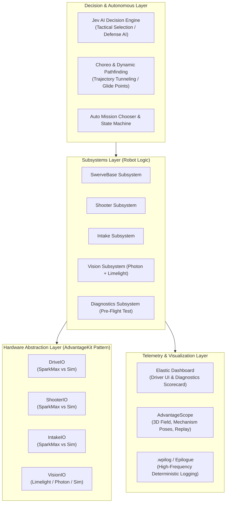

# 📐 2026–2027 Robot Software Architecture & System Design

Welcome to the technical architecture guide for Team 8334's 2026/2027 robot platform. This document outlines the system hierarchy, hardware abstraction layers, dual-vision platform, pre-flight diagnostics, and the Jev AI decision engine.

---

## 1. High-Level System Architecture Diagram

```
┌──────────────────────────────────────────────────────────────────────────┐
│                   DECISION & TACTICAL STRATEGY LAYER                     │
│  - Jev AI Decision Engine (local 50 Hz policy + async TypeSafe choices)  │
│  - Choreo Trajectory Tracking & Dynamic Obstacle Avoidance               │
│  - Autonomous Mission Chooser & Teleop State Machine                     │
└────────────────────────────────────┬─────────────────────────────────────┘
                                     ▼
┌──────────────────────────────────────────────────────────────────────────┐
│                         SUBSYSTEM LOGIC LAYER                            │
│  - SwerveBase (Kinematics, Glide Points, Field-Oriented Drive)           │
│  - Shooter (Distance-to-RPM Dual Flywheel Tables, Kicker Control)        │
│  - Intake (Continuous ProfiledPID [0,360], Gravity Feedforward)          │
│  - Vision (Multi-Tag AprilTag Fusion: Limelight MT2 + PhotonVision)      │
│  - Diagnostics (15-Second Pre-Flight Self-Test Sequencer)                │
└────────────────────────────────────┬─────────────────────────────────────┘
                                     ▼
┌──────────────────────────────────────────────────────────────────────────┐
│                   HARDWARE IO ABSTRACTION (AdvantageKit)                 │
│         DriveIO         ShooterIO         IntakeIO         VisionIO      │
│        /      \         /       \         /      \         /      \      │
│    [Spark]  [Sim]   [Spark]   [Sim]   [Spark]  [Sim]   [LL/PV]  [PVSim]  │
└────────────────────────────────────┬─────────────────────────────────────┘
                                     ▼
┌──────────────────────────────────────────────────────────────────────────┐
│                     TELEMETRY & VISUALIZATION LAYER                      │
│  - Elastic Dashboard (Driver UI, Feature Switches, Pre-Flight Scorecard) │
│  - AdvantageScope (3D Field, Robot Poses, Mechanism Visualizer)          │
│  - Deterministic Replay (.wpilog Byte-for-Byte Match Simulation)         │
└──────────────────────────────────────────────────────────────────────────┘
```

---

## 2. Core Architectural Pillars



---

## 3. Subsystem Breakdown & Design Contracts

### A. Swerve Drive (`SwerveBase.java`)
- **Kinematics Engine**: Powered by YAGSL (Yet Another Generic Swerve Library) with custom high-speed heading correction and skew compensation.
- **Simulation**: Backed by `IronMaple` rigid-body 2D simulation for true carpet friction, wheel slip, and simulated bumper collision physics.
- **Navigation**: Integrated with `GlideConstants` for automated transit to strategic field zones (Hub, Feeders, Trenches).
- **Contact Watchdog**: `SwerveBase` supplies measured and requested field-relative chassis speeds; robot-frame IMU acceleration is rotated into field coordinates before collision and stall checks. Escape commands therefore share the field-relative frame used by Glide drive output.
- **Field obstacle map**: `Navigation/FieldMap.java` stores Hub cores, trench divider walls, and each ramp as separate AABBs. `ObstacleHandling` defaults to `IMPASSABLE`; every split piece blocks pathfinding in every mode. The legacy `PHYSICS` and `ABSTRACT` labels remain accepted for dashboard/API compatibility but no longer make ramps traversable. `StaticPathfinder` applies the 0.45 m bumper half-width once, validates roadmap edges and endpoint connectors, and adds an outward escape waypoint when the measured start is inside an inflated obstacle. It stops safely if no valid route exists; hard fuel-target checks exclude ramps. `TrajectoryController` holds that escape waypoint until clear and only advances past a waypoint plane when cross-track error is within 0.45 m, preventing missed tunnel turns from being skipped.

### B. Dual-Flywheel Shooter (`Shooter.java`)
- **Velocity Control**: Independent PID + `SimpleMotorFeedforward` controllers for Left (CAN 12) and Right (CAN 11) flywheels with integrator anti-windup range (`-1.5 to +1.5`, `Shooter.java:135-136` — integrator only, not output clamp).
- **Empirical Tuning Curves**: Interpolating distance lookup tables (`leftRpmTable` & `rightRpmTable`, 1.2 m→2400/2450 … 6.0 m→4500/4550, `Shooter.java:139-155`) providing tailored RPM curves and differential spin.
- **Kicker Feeder**: 12V pulse actuation (`ShooterConstants KICKER_VOLTAGE=12.0`) sequenced strictly after flywheels acquire speed (error < 150 RPM, release hysteresis > 750 RPM, `Shooter.java:362-364`; canonical `RPM_TOLERANCE=50.0`). Alliance-zone gate + 1.2–6.5 m solution window (`Shooter.java:193-194`); predictive lookahead 0.13 s for shoot-on-the-fly.
- **3D Visualization**: Real-time 3D pose broadcast to `Subsystems/Shooter/ShooterPose3d` for AdvantageScope mechanism view.

### C. Articulated Ground Intake (`Intake.java`)
- **Pivot Arm Control**: Trapezoidal motion profiling (`ProfiledPIDController`) with continuous `[0, 360]` angle wrapping.
- **Gravity Compensation**: `ArmFeedforward` calculation relative to horizontal mechanical position (`250°`).
- **States**: `Standby` (347°), `Intaking`/`Down` (250°), plus `STANDBY_INTAKING`, `STANDBY_REVERSED`, `IDLE`, `FEEDING`, `EJECTING`, `CHARACTERIZATION`, `Manual`, `Disabled` (`Intake.java:53-65`).
- **Jam Detection**: Roller stall > 30A for > 0.5 s triggers 1.0 s auto-eject (`IntakeConstants.java:25-27`, `Intake.java:463-474`).

### D. Dual-Vision Platform (`Vision.java` / `ThirdParty/LimelightHelpers.java`)
- **Front Camera**: Limelight 3/3G running MegaTag2 feeding raw gyro yaw rates (`DegreesPerSecond`) directly into pose estimation.
- **Side/Back Coprocessor**: Orange Pi 5 running PhotonVision with `PhotonPoseEstimator` (`MULTI_TAG_PNP_ON_COPROCESSOR`).
- **Desktop Simulation**: `Sim/LimelightSim` + `Sim/VisionSim` wrapped by `Subsystems/vision/VisionIOSim.java` generating simulated AprilTag detections in SimGUI without physical cameras.
- **Object Detection**: `hasGamePiece` boolean telemetry feeds "Ball Hunt" (`Vision.java:136-155`); no YOLOv8 NPU pipeline code in repo.

### E. Pre-Flight Diagnostics (`Test/Diagnostics.java` / `TestMode.java`)
- **15-Second Automated Pit Check** (`Diagnostics.java:177-320`, progress `/15.0`):
  1. *CAN Bus Audit*: Verifies all CAN devices acknowledge heartbeat.
  2. *Swerve Motor Pulse*: Spins each drive wheel at +1.5V to verify encoder velocity sign.
  3. *Steer Alignment Check*: Applies +1.5V steer voltage (no angle assertion, `Diagnostics.java:232`).
  4. *Intake Profile Check*: Verifies arm travel time and flags current draw > 25A (mechanical binding).
  5. *Shooter Ramping*: Ramps flywheels to 1500 RPM and checks error < ±50 RPM (`Diagnostics.java:302`).
  6. *Vision Link Check*: Pass if `hasTarget() || getIO() != null`, else WARN (`Diagnostics.java:314`) — no FPS/latency assertion.
- **Scorecard**: Displays a color-coded status grid on Elastic Dashboard before matches.

### F. Driver Haptic Feedback (`Hardware/Controller.java` & `Teleop.java`)
- **Non-Blocking Sequenced Rumbles**: Tactile notification engine operating independently of robot control loops.
- **Rumble Patterns**:
  - `TARGET_LOCKED`: Double crisp pulse (100ms on, 80ms off, 100ms on) notifying driver and operator when the robot is aligned with the hub and flywheels are up to speed.
  - `BALL_ACQUIRED`: Confirmation pulse when game piece is seated in the hopper.
  - `HARDWARE_WARNING`: Rapid triple pulse alerting drivers when vision or sensor degradation occurs mid-match.
  - `MATCH_TIME_WARNING`: Sustained deep rumble warning drivers at T-30s and T-15s before match conclusion.

### G. Non-CLI Driver Alert Infrastructure (`Telemetry/Alert.java`, `Telemetry/AlertManager.java`, `Subsystems/LEDs.java`)
- **No Console Clutter**: Replaces spammy driver station console printouts with persistent visual indicators.
- **Elastic Dashboard Banner**: Color-coded single-line top banner (`Driver/AlertBanner`) and active tables (`Alerts/Errors`, `Alerts/Warnings`).
- **Addressable LEDs Integration**:
  - `STROBE_RED`: Critical hardware fault (disconnected encoder, motor stall).
  - `SOLID_ORANGE`: System warning / degraded sensor operation (vision lost, auto-clearing jam).
  - `SOLID_GREEN`: Target locked & ready to shoot.
  - `STROBE_GOLD`: Flywheels spinning up.
  - `SOLID_BLUE` / `SOLID_RED`: Default Alliance color.

### H. Sensor Redundancy & Graceful Degradation
- **Vision Watchdog (`Vision.java:91-93,115-117`)**: Rejects stale packets (>150 ms), excess yaw rate (360°/s), and distant tags (4.0 m, single-tag penalty, `Constants.java:95-108`). Falls back to pure odometry with driver alert on degradation.
- **Intake Absolute Encoder Fallback (`Intake.java:450-457`)**: On invalid `armPositionDeg`, falls back to NEO relative-encoder delta tracking (`3.6°` per motor rotation), preventing lockup.
- **Current Stall Jam Clearing**: Monitors roller motor current (>30A for >0.5s) to detect mechanical jams, automatically reversing rollers to eject the obstruction without requiring driver intervention.

### I. Standardized Blue-Origin Coordinate Geometry (`Utils/AllianceFlipUtil.java`)
- **Single Source of Truth**: All field coordinates, waypoints, and target structures are defined once in Blue Alliance coordinates ($X=0$ at Blue wall).
- **Dynamic Field Mirroring**: Automatically transforms coordinates, rotations, and poses across the field midline ($X_{\text{red}} = 16.535 - X_{\text{blue}}$, $\theta_{\text{red}} = 180^\circ - \theta_{\text{blue}}$) when DriverStation is set to Red Alliance.

### J. Jev AI Unified Cognitive Architecture (System 1 + System 2)
Simulation sparring and the default co-pilot path use a deterministic, re-entrant local System 1 (Tactical Reflex) + System 2 (Executive Strategy) architecture. When the TypeSafe feature toggle is enabled, the player Co-Pilot and simulator bots can also request asynchronous TypeSafe macro decisions; local tactical generation and safety checks still run every cycle:

```
┌─────────────────────────────────────────────────────────────────────────────┐
│                      SYSTEM 2: EXECUTIVE STRATEGY                           │
│  - Evaluates local utility matrix; optional TypeSafe result is advisory      │
│  - Weighted by Archetype (Cycler, Bully, Competitor, Defender, Co-Pilot)   │
│  - Cloud HTTP is asynchronous; only fresh, locally eligible choices apply  │
└──────────────────────────────────────┬──────────────────────────────────────┘
                                       │ Active Objective
                                       ▼
┌─────────────────────────────────────────────────────────────────────────────┐
│                      SYSTEM 1: TACTICAL REFLEX                              │
│  - Resolves active objective into concrete AIActionIntent                   │
│  - Cluster-Weighted Scent: Gaussian spatial density kernel (σ=0.5m, R=1.3m)│
│  - Generates navigation target pose, heading aim override, and kick triggers│
└──────────────────────────────────────┬──────────────────────────────────────┘
                                       │ Action Commands
                                       ▼
┌─────────────────────────────────────────────────────────────────────────────┐
│                    MULTI-ROBOT & SUBSYSTEM EXECUTION                        │
│  - AIRobotSim & AIRobotInstance: 1 to 6 concurrent sparring bots in sim     │
│  - AutonomousTeleopAgent: One-Button Auto-Cycle Co-Pilot on real robot      │
│  - MatchCoach: Real-time driver coaching HUD recommendations                │
└─────────────────────────────────────────────────────────────────────────────┘
```

1. **Game-Agnostic Abstraction Layer**:
   - [`StrategicObjective`](src/main/java/frc/robot/Intelligence/StrategicObjective.java): Macro objectives for depot/midfield/home/opponent-zone harvesting, Hub scoring and staging, shuttle/long-range scoring, defense/teamwork, endgame, and idle; retains game-agnostic aliases.
   - [`WorldState`](src/main/java/frc/robot/Intelligence/WorldState.java): Immutable snapshot with game-agnostic aliases and 2026 record components `heldFuelCount()`, `isAllianceHubActive()`, and `timeUntilHubShift()`.
   - [`MatchKnowledge`](src/main/java/frc/robot/Intelligence/MatchKnowledge.java): Two-tier information model. Driver-assist tier (`unknown()`): only self-perceivable state, opponents unobserved. Sim-sparring tier: robot knowledge plus player-visible match context (score differential, both sides' poses/velocities, held/scored balls).
   - [`AIActionIntent`](src/main/java/frc/robot/Intelligence/AIActionIntent.java) and [`StrategicPlan`](src/main/java/frc/robot/Intelligence/StrategicPlan.java): Concrete subsystem output plus current/next objective and estimated transition time. Autonomous batch, in-range, and clock-low dump decisions take priority over alliance-zone sweeping. Co-pilot and sim-bot next-objective telemetry is published to NetworkTables; trench corridor yield is not implemented yet.
   - [`TypeSafeJevClient`](src/main/java/frc/robot/Intelligence/TypeSafeJevClient.java): Optional `jev-latest` choice/noul request with bearer-key authentication, a fair shared FIFO dispatcher spacing all calls by 150 ms, a 150 ms player per-caller interval, a 1 s per-simulator-bot interval, and a 1.0 s request timeout. Network work and JSON parsing run on a daemon worker; each simulator bot has its own in-flight state and latest decision. The feature toggle defaults off; no key, stale/error response, confidence below 0.60, locally ineligible objective, local priority of at least 0.95, or unsafe autonomous choice keeps local utility selection. This spaces requests but does not enforce a per-match spend budget.

2. **Multi-Robot Simultaneous Execution (`AIRobotSim` & `AIRobotInstance`)**:
   - `AIRobotInstance`: Encapsulates an independent simulated swerve drive chassis, intake mechanism, PID controllers, and behavior archetype.
   - `AIRobotSim`: Multi-robot manager for max 5 AI (3 opponents + 2 allies) + player = 6 on field, scaling via `Simulation/OpponentCount` (1 to 3 bots) and `Simulation/AllyCount` (0 to 2 bots), with independent opponent/ally speed scales. Every sim robot opens with 8 fuel.
   - `TrainingMatchScenario` maps Blue slot 0 to a training-only `AIRobotInstance`, later Blue slots to allies, and Red slots to opponents. Reset applies every robot's archetype/pose/preload; the main `SwerveBase` is parked off-field and excluded from the training roster, then restored to its previous pose when training is cleared. Training world state, match knowledge, defensive marking, scoring, and climb attribution use the configured Blue roster. The autonomous match lifecycle, headless runner, and result summary remain unfinished.
   - Opponents skate against the player, allies skate with the player; per-bot archetype choosers on the Simulation Elastic tab.
   - **Soft Peer Separation**: Applies inverse-distance repulsive forces ($r < 1.10\text{m}$) across peer robots, preventing clustering or jamming during contested pickups.
   - **Staggered Spawning**: Staggers initial positions across non-overlapping corridor coordinates ($Y = 4.035\text{m}, 5.80\text{m}, 2.25\text{m}$).
   - **Wall-Band Fuel Targeting**: Fuel filters skip only hard footprints (hub ramps, tower poles) plus live dynamic obstacles — never the 0.45 m perimeter band — and hunt approaches use wall-normal standoffs, so balls tight to walls stay collectable.

3. **Dual-Use Engine (Simulation Sparring + Real-Robot Co-Pilot)**:
   - The identical `evaluatePolicy` pipeline drives:
     - The Sparring Opponents in simulation (`Archetype.AUTONOMOUS_CYCLER`, `DEFENSE_BULLY`, `ADAPTIVE_COMPETITOR`) with full player-visible `MatchKnowledge`.
     - The Driver Assist Co-Pilot on the real robot (`Archetype.CO_PILOT` via `AutonomousTeleopAgent`) with `MatchKnowledge.unknown()` — opponents unobserved, lane left to the driver.
     - The Match Coach in the pit / driver station (`MatchCoach.java`).

---

### K. Simulation Match Engine (Scoring, Hub Schedule & Rules)

Practice matches run a complete rulebook-aware scoring loop in `Sim/`:

- **Official hub schedule (`Sim/HubSchedule.java`, rules 6.4/6.4.1)**: AUTO/TRANSITION/END GAME both-active; SHIFT 1–4 alternate a single active hub, seeded by AUTO fuel totals (most AUTO fuel sits out first; tie → random). The sim acts as FMS at `teleopInit`, mirroring the seed to game data. 25 s shift boundaries + 3 s grace live in `HubSchedule.java`; Elastic shows the official states.
- **3-second processing grace (rule 6.5)**: balls already scored keep counting up to 3 s after deactivation; new launches into an inactive hub stay illegal (G407).
- **Reliable score capture (`Sim/ShotTracker.java`)**: the hub physically swallows balls before the projectile's analytic hit-time, which used to silently drop most scores. Every launch is tracked; disappearance near the funnel resolves exactly once as scored (active hub, full per-robot attribution), wasted (inactive hub), or clean miss.
- **Scoreboard (`Sim/MatchScoreTracker.java`)**: 1 pt per fuel (active hub only, split AUTO/TELEOP), 10 pts per climb, MINOR 5 / MAJOR 15 foul points to the opponent, plus win/fuel/climb ranking points. Live red/blue totals, per-robot balls (Player, Bot 0–2, Ally 1–2), and penalty breakdowns publish under `Scoreboard/*` to the dedicated Elastic Match Scoreboard tab.
- **Sim referee (`Sim/RefereeSim.java`)**: AUTO centerline contact (MAJOR), G407 zone shooting (MAJOR, checked at every launch site), G418 pins (MINOR, then MAJOR per uncorrected 3 s), G420 tower protection in the last 30 s (MAJOR).

---

## 4. WPILib 2027 & Systemcore Roadmap
As WPILib transitions to the **Systemcore** platform (quad-core ARM controller) and retires legacy tools (Shuffleboard/SmartDashboard):
1. **Elastic Dashboard**: Our primary driver display with custom layout in `elastic-layout.json`.
2. **AdvantageScope**: Standard 3D visualizer for robot field poses, arm articulation, and shooting vectors.
3. **Telemetry Encapsulation**: All dashboard variables are routed through `Dashboard.java` and `TunableNumber.java` for painless migration to 2027 Telemetry/Tunables APIs.
4. **Commands (v2, roadmap to v3)**: Core code uses Commands v2 (`Commands.run`); actions designed for clean conversion to coroutines in WPILib 2027.
