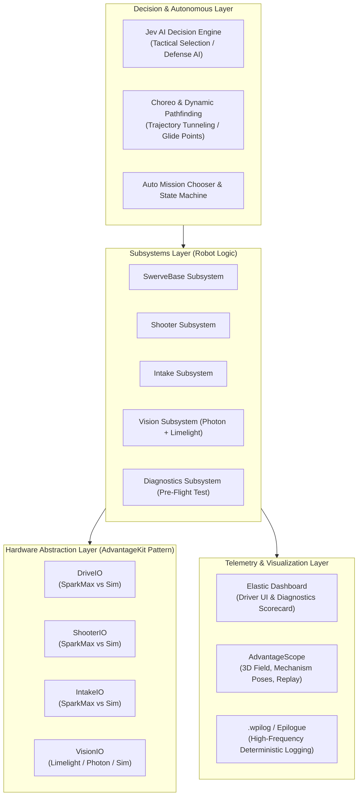

# 📐 2026–2027 Robot Software Architecture & System Design

Welcome to the technical architecture guide for Team 8334's 2026/2027 robot platform. This document outlines the system hierarchy, hardware abstraction layers, dual-vision platform, pre-flight diagnostics, and the Jev AI decision engine.

---

## 1. High-Level System Architecture Diagram

```
┌──────────────────────────────────────────────────────────────────────────┐
│                   DECISION & TACTICAL STRATEGY LAYER                     │
│  - Jev AI Decision Engine (local 50 Hz policy + async TypeSafe choices)  │
│  - Choreo Trajectory Tracking & Dynamic Obstacle Avoidance               │
│  - Autonomous Mission Chooser & Teleop State Machine                     │
└────────────────────────────────────┬─────────────────────────────────────┘
                                     ▼
┌──────────────────────────────────────────────────────────────────────────┐
│                         SUBSYSTEM LOGIC LAYER                            │
│  - SwerveBase (Kinematics, Glide Points, Field-Oriented Drive)           │
│  - Shooter (Distance-to-RPM Dual Flywheel Tables, Kicker Control)        │
│  - Intake (Continuous ProfiledPID [0,360], Gravity Feedforward)          │
│  - Vision (Multi-Tag AprilTag Fusion: Limelight MT2 + PhotonVision)      │
│  - Diagnostics (15-Second Pre-Flight Self-Test Sequencer)                │
└────────────────────────────────────┬─────────────────────────────────────┘
                                     ▼
┌──────────────────────────────────────────────────────────────────────────┐
│                   HARDWARE IO ABSTRACTION (AdvantageKit)                 │
│         DriveIO         ShooterIO         IntakeIO         VisionIO      │
│        /      \         /       \         /      \         /      \      │
│    [Spark]  [Sim]   [Spark]   [Sim]   [Spark]  [Sim]   [LL/PV]  [PVSim]  │
└────────────────────────────────────┬─────────────────────────────────────┘
                                     ▼
┌──────────────────────────────────────────────────────────────────────────┐
│                     TELEMETRY & VISUALIZATION LAYER                      │
│  - Elastic Dashboard (Driver UI, Feature Switches, Pre-Flight Scorecard) │
│  - AdvantageScope (3D Field, Robot Poses, Mechanism Visualizer)          │
│  - Deterministic Replay (.wpilog playback; low-variance, not bit-exact — see §3K)         │
└──────────────────────────────────────────────────────────────────────────┘
```

---

## 2. Core Architectural Pillars


```mermaid
flowchart TD
    subgraph UpperLayer["Decision & Autonomous Layer"]
        Jev["Jev AI Decision Engine\n(Tactical Selection / Defense AI)"]
        Choreo["Choreo & Dynamic Pathfinding\n(Trajectory Tunneling / Glide Points)"]
        AutoChooser["Auto Mission Chooser & State Machine"]
    end

    subgraph SubsystemsLayer["Subsystems Layer (Robot Logic)"]
        Swerve["SwerveBase Subsystem"]
        ShooterSub["Shooter Subsystem"]
        IntakeSub["Intake Subsystem"]
        VisionSub["Vision Subsystem (Photon + Limelight)"]
        DiagSub["Diagnostics Subsystem (Pre-Flight Test)"]
    end

    subgraph IOLayer["Hardware Abstraction Layer (AdvantageKit Pattern)"]
        DriveIO["DriveIO\n(SparkMax vs Sim)"]
        ShooterIO["ShooterIO\n(SparkMax vs Sim)"]
        IntakeIO["IntakeIO\n(SparkMax vs Sim)"]
        VisionIO["VisionIO\n(Limelight / Photon / Sim)"]
    end

    subgraph TelemetryLayer["Telemetry & Visualization Layer"]
        Elastic["Elastic Dashboard\n(Driver UI & Diagnostics Scorecard)"]
        AScope["AdvantageScope\n(3D Field, Mechanism Poses, Replay)"]
        DataLog[".wpilog / Epilogue\n(High-Frequency Deterministic Logging)"]
    end

    UpperLayer --> SubsystemsLayer
    SubsystemsLayer --> IOLayer
    SubsystemsLayer --> TelemetryLayer
```

---

## 3. Subsystem Breakdown & Design Contracts

### A. Swerve Drive (`SwerveBase.java`)
- **Kinematics Engine**: Powered by YAGSL (Yet Another Generic Swerve Library) with custom high-speed heading correction and skew compensation.
- **Simulation**: Backed by `IronMaple` rigid-body 2D simulation for true carpet friction, wheel slip, and simulated bumper collision physics.
- **Navigation**: Integrated with `Navigation/GlidePoints.java` for automated transit to strategic field zones (Hub, Feeders, Trenches).
- **Contact Watchdog**: `SwerveBase` supplies measured and requested field-relative chassis speeds; robot-frame IMU acceleration is rotated into field coordinates before collision and stall checks. Escape commands therefore share the field-relative frame used by Glide drive output.
- **Unreachable-target recovery**: `Navigation/TargetProgressWatchdog.java` is the peer-independent counterpart to `ContactWatchdog`. While a bot commands > 0.12 m/s but closes < 0.25 m on its navigation target over a 3.0 s window, the target is blacklisted (1.0 m radius, 20 s TTL) and consumed by the Jev fuel selectors through `evaluatePolicy(..., Set<Translation2d> blockedFuel)`; a 1.2 s escape then backs the bot off the abandoned piece, sliding along a perimeter wall when the piece sits between the bot and that wall. Intentional holds (commanded < 0.12 m/s, or within 0.60 m of the target) never trigger, so staging and plant-and-fire are untouched. When target churn occurs while pinned (measured speed < 0.15 m/s), `TargetProgressWatchdog` preserves `pinnedSec` across target changes; after `STATIC_ESCALATION_COUNT = 3` consecutive churn escapes with no intervening progress, it escalates to blacklisting the target to break the churn loop. State `TARGET_UNREACHABLE` plus per-bot `UnreachableRecovering` / `UnreachableNoProgressSec` telemetry.
- **Stuck recovery — three layers, each covering a different failure mode.** A 2026-09-28 probe swept 444,550 (start, peer, goal) combinations through `findPath` and found **zero** route failures (0.476 m minimum segment clearance over 203,401 paths), so the roadmap topology is *not* a stall source; the defects were in the reactive layer and the detectors:
  1. **Peer deadlock** (`ContactWatchdog.updateDeadlockOnly`): stall + peer < 1.10 m → forward 0.3× plus a randomized ±1.2 m/s jink; the trench variant reverses at −0.8× with a 0.5 s trigger, jittered cooldown, per-attempt escalation, and a `TRENCH_YIELD` hold.
  2. **Unreachable target** (`TargetProgressWatchdog`): peer-independent. 3.0 s of commanded motion with no closing distance → blacklist the point (1.0 m radius, 20 s TTL, fed to the Jev fuel selectors) and escape for 1.2 s, sliding along a perimeter wall rather than backing into it. Pinned target churn escalates to blacklisting on the 3rd consecutive escape (`STATIC_ESCALATION_COUNT = 3`) to break unstick loops.
  3. **APF drive inversion** (`DynamicRouter.computePotentialFields`): when repulsion exceeds the nominal command the drive is decomposed, not summed — see below.
  Both stall detectors gate on commanded speed > **0.12 m/s** (`TargetProgressWatchdog.COMMAND_MIN_MPS` and `ContactWatchdog.STALL_CMD_SPEED_MIN`, the latter also read by `AIRobotInstance.isStalled` so the two cannot drift). This is a *hold* floor, not a stall threshold: the previous 0.80 m/s value was above `TrajectoryController`'s 0.25 m/s carpet-friction breakout floor, so a robot wedged while creeping never fired. A true hold commands ≈0 and still decays, and a converging robot is protected because the decision is made on progress, not speed. **The two defects formed a closed trap** — APF cancelled the drive, the resulting crawl fell into the sub-0.80 m/s blind band, and no watchdog fired — so neither fix is sufficient alone. Covered by `StuckRecoveryTest` and `RepulsionBoundsTest`.
- **Dynamic reactive avoidance** (`DynamicRouter`): artificial potential field layer. The drive is **decomposed rather than summed**. Forward progress is retained through a saturating relaxation, `nominal - saturation * (1 - exp(-backPressure/saturation))` with `MAX_BACKPRESSURE_FRACTION` 0.65, so it approaches its floor smoothly rather than hitting a clamp threshold with a kink — the relaxed progress constraint from the CLF/CBF literature (arXiv:2211.11348, 2507.14700). The lateral correction is the **perpendicular** repulsion component plus a slide proportional to the back-pressure (`LATERAL_FRACTION_OF_REPULSION` 0.50, capped at `MAX_LATERAL_MPS` 2.50), so the robot goes *around* the peer instead of into it. Summing instead inverted the drive outright — probe: nominal −1.500 m/s west with a peer ahead produced **+2.270 m/s east**, commanding the robot away from its target, or cancelled it to a 0.345 m/s crawl. Carrying the perpendicular component explicitly is load-bearing: a peer abeam the robot has almost no along-drive component, so treating only the opposing term drives straight past it. A pose-parity tie-break supplies the slide direction when two symmetric flanking peers cancel each other's lateral terms. Telemetry: `DynamicAvoidance/ForwardRetained`, `RepulsionMagnitude`.
- **Bounded repulsion derivative**: the repulsion terms use `repulsiveFalloff(d)` / `wallFalloff(d, margin)`, which are inverse-distance but saturate at a distance floor (`REPULSION_MIN_DISTANCE_M` 0.35 peers, `WALL_MIN_DISTANCE_M` 0.20 walls) instead of diverging. The textbook `k * (1/d - 1/d0)` form reached ≈48 m/s (peers) and ≈47 m/s (walls) at the old guards; `MAX_SPEED` hid the magnitude but the commanded *direction* became a near-step function of position at contact. The floors sit below any behaviourally-relevant distance, so the pre-contact curve is unchanged. Ref: arXiv:2402.11601.
- **Field obstacle map**: `Navigation/FieldMap.java` stores Hub cores, trench divider walls, and each ramp as separate AABBs. Every feature is defined once for Blue and mirrored for Red (`X_red = FIELD_LENGTH - X_blue`, Y unchanged); the sole exceptions are `FieldMap.Depots`, whose two loading bays are genuinely asymmetric on the real field and are documented as measured insets, and the tower-post AABBs at `FieldMap.java:506-511`, which mirror both axes deliberately. `ObstacleHandling` defaults to `IMPASSABLE`; every split piece blocks pathfinding in every mode. The legacy `PHYSICS` and `ABSTRACT` labels remain accepted for dashboard/API compatibility but no longer make ramps traversable. `StaticPathfinder` applies the 0.45 m bumper half-width once, validates roadmap edges and endpoint connectors, and adds an outward escape waypoint when the measured start is inside an inflated obstacle. It stops safely if no valid route exists. Hard fuel-target checks **include** ramps — deliberately, so fuel resting on a ramp slope is not a Jev target and bots route around rather than climb to collect. `TrajectoryController` holds that escape waypoint until clear and only advances past a waypoint plane when cross-track error is within the gate — 0.45 m open-field (`CROSS_TRACK_GATE_M`), 0.22 m inside trenches (`TRENCH_CROSS_TRACK_GATE_M`, `TrajectoryController.java:65,208`), preventing missed tunnel turns from being skipped.
- **Trench corridor geometry**: the low-clearance band is anchored to the **raw** wall face (`Trenches.TOP_TRENCH_MIN_Y = NORTH_CENTER_Y + WALL_Y_LEN/2 = 6.7903`), while the planning footprint inflates the wall by `ROBOT_RADIUS` on every face — so the inflation intrudes **0.45 m** into the band. That is structural, not a bug: it shrinks the drivable band rather than making anything unreachable, and both trenches are symmetric, so the Blue/Red mirror rule holds. Result: the drivable centre band is **0.3787 m** wide, the lane centreline sitting 0.1797 m (top) / 0.1787 m (bottom) clear of the inflated wall and 0.1990 m off the perimeter. Every published lane point, roadmap node `#5`–`#12`, and `planTunnelRoute` funnel waypoint (tightest: 3.50, 0.1932 m) stays clear. **Resolved Sep 28:** the 0.3787 m band is narrower than the open-field 0.45 m cross-track gate, so the controller now uses a trench-specific 0.22 m gate (`TRENCH_CROSS_TRACK_GATE_M`, `TrajectoryController.java:65,208`) — a robot shoved off the lane centreline re-converges instead of passing the wide gate while inside the inflated footprint. Pinned by `TrenchCorridorClearanceTest`, diagrammed in `docs/nav/roadmap.html`.

### B. Dual-Flywheel Shooter (`Shooter.java`)
- **Velocity Control**: Independent PID + `SimpleMotorFeedforward` controllers for Left (CAN 12) and Right (CAN 11) flywheels with integrator anti-windup range (`-1.5 to +1.5`, `Shooter.java:134-135` — integrator only, not output clamp).
- **Empirical Tuning Curves**: Interpolating distance lookup tables (`leftRpmTable` & `rightRpmTable`, 1.2 m→2400/2450 … 6.0 m→4500/4550, `Shooter.java:138-154`) providing tailored RPM curves and differential spin.
- **Kicker Feeder**: 12V pulse actuation (`ShooterConstants KICKER_VOLTAGE=12.0`) sequenced strictly after flywheels acquire speed (error < 150 RPM to engage, release hysteresis > 750 RPM, `Shooter.java:357-359`). Alliance-zone gate + 1.2–6.5 m solution window (`Shooter.java:189,242`); predictive lookahead 0.13 s for shoot-on-the-fly. (Separate `ShooterConstants.RPM_TOLERANCE=50.0` is the Test-mode tuning threshold, not the match kicker gate.)
- **3D Visualization**: Real-time 3D pose broadcast to `Subsystems/Shooter/ShooterPose3d` for AdvantageScope mechanism view.

### C. Articulated Ground Intake (`Intake.java`)
- **Pivot Arm Control**: Trapezoidal motion profiling (`ProfiledPIDController`) with continuous `[0, 360]` angle wrapping.
- **Gravity Compensation**: `ArmFeedforward` calculation relative to horizontal mechanical position (`250°`).
- **States**: `Standby` (347°), `Intaking`/`Down` (250°), plus `STANDBY_INTAKING`, `STANDBY_REVERSED`, `IDLE`, `FEEDING`, `EJECTING`, `CHARACTERIZATION`, `Manual`, `Disabled` (`Intake.java:53-56`ff).
- **Jam Detection**: Roller stall > 30A for > 0.5 s triggers 1.0 s auto-eject (`IntakeConstants.java:25-27`, `Intake.java:453-472`).

### D. Dual-Vision Platform (`Vision.java` / `ThirdParty/LimelightHelpers.java`)
- **Front Camera**: Limelight 3/3G running MegaTag2 feeding raw gyro yaw rates (`DegreesPerSecond`) directly into pose estimation.
- **Side/Back Coprocessor**: Orange Pi 5 running PhotonVision. The coprocessor IO reads a pre-computed `robotPose` NT array directly (`Subsystems/vision/VisionIOPhotonVision.java:80-91`); there is no onboard `PhotonPoseEstimator` in this repo.
- **Desktop Simulation**: `Sim/LimelightSim` + `Sim/VisionSim` wrapped by `Subsystems/vision/VisionIOSim.java` generating simulated AprilTag detections in SimGUI without physical cameras.
- **Object Detection**: `hasGamePiece` boolean telemetry feeds "Ball Hunt" (`Vision.java:136-155`); no YOLOv8 NPU pipeline code in repo.

### E. Pre-Flight Diagnostics (`Test/Diagnostics.java` / `TestMode.java`)
- **15-Second Automated Pit Check** (`Diagnostics.java:177-320`, progress `/15.0`):
  1. *CAN Bus Audit*: Verifies all CAN devices acknowledge heartbeat.
  2. *Swerve Motor Pulse*: Spins each drive wheel at +1.5V to verify encoder velocity sign.
  3. *Steer Alignment Check*: Applies +1.5V steer voltage and asserts movement (delta ≥ 1.0 per module, `Diagnostics.java:245-251`).
  4. *Intake Profile Check*: Verifies arm travel time and flags current draw > 25A (mechanical binding).
  5. *Shooter Ramping*: Ramps flywheels to 1500 RPM and checks error < ±50 RPM (`Diagnostics.java:302`).
  6. *Vision Link Check*: Pass if `hasTarget() || getIO() != null`, else WARN (`Diagnostics.java:314`) — no FPS/latency assertion.
- **Scorecard**: Displays a color-coded status grid on Elastic Dashboard before matches.

### F. Driver Haptic Feedback (`Hardware/Controller.java` & `Teleop.java`)
- **Non-Blocking Sequenced Rumbles**: Tactile notification engine operating independently of robot control loops.
- **Rumble Patterns**:
  - `TARGET_LOCKED`: Double crisp pulse (100ms on, 80ms off, 100ms on) notifying driver and operator when the robot is aligned with the hub and flywheels are up to speed.
  - `BALL_ACQUIRED`: Confirmation pulse when game piece is seated in the hopper.
  - `HARDWARE_WARNING`: Rapid triple pulse alerting drivers when vision or sensor degradation occurs mid-match.
  - `MATCH_TIME_WARNING`: Sustained deep rumble warning drivers at T-30s and T-15s before match conclusion.

### G. Non-CLI Driver Alert Infrastructure (`Telemetry/Alert.java`, `Telemetry/AlertManager.java`, `Subsystems/LEDs.java`)
- **No Console Clutter**: Replaces spammy driver station console printouts with persistent visual indicators.
- **Elastic Dashboard Banner**: Color-coded single-line top banner (`Driver/AlertBanner`) and active tables (`Alerts/Errors`, `Alerts/Warnings`).
- **LED Driver Integration (REV Blinkin via PWM, `Subsystems/LEDs.java`)**:
  - `STROBE_RED`: Critical hardware fault (disconnected encoder, motor stall).
  - `SOLID_ORANGE`: System warning / degraded sensor operation (vision lost, auto-clearing jam).
  - `SOLID_GREEN`: Target locked & ready to shoot.
  - `STROBE_GOLD`: Flywheels spinning up.
  - `SOLID_BLUE` / `SOLID_RED`: Default Alliance color.

### H. Sensor Redundancy & Graceful Degradation
- **Vision Watchdog (`Vision.java:91-93,115-117`)**: Rejects stale packets (>150 ms), excess yaw rate (360°/s), and distant tags (4.0 m, single-tag penalty). Falls back to pure odometry with driver alert on degradation.
- **Intake Absolute Encoder Fallback (`Intake.java:450-457`)**: On invalid `armPositionDeg`, falls back to NEO relative-encoder delta tracking (`3.6°` per motor rotation), preventing lockup.
- **Current Stall Jam Clearing**: Monitors roller motor current (>30A for >0.5s) to detect mechanical jams, automatically reversing rollers to eject the obstruction without requiring driver intervention.
- **Main-Breaker Thermal Budget (`Hardware/BreakerModel.java`, `Hardware/PowerBudgetManager.java`, adapted from 6328's `BreakerModel`/`FinanceDepartment`)**: the 120 A main breaker is modelled with Miner's-rule damage accumulation, $dD/dt = 1/T_{\text{trip}}(I)$ for $I > 120$ A, with trip times interpolated from the datasheet (1.35× → 1800 s, 2× → 70 s, 3× → 15 s, 5× → 7 s) and exponential cooldown ($\tau = 60$ s) at or below rating. `SwerveBase.update()` feeds it the same battery-voltage / bus-current sample as the instantaneous brownout ramp and takes `min(brownoutScale, budgetScale)`: drive derates from 1.0 at $D = 0.75$ to 0.35 at $D = 1.0$. Short acceleration bursts cost almost nothing; only sustained overload throttles. The manager's own voltage ramp (9.2 → 7.5 V) is looser than `SwerveBase`'s existing 9.5 V ramp, so voltage behaviour is unchanged — the breaker term is the only new input. Alerts: `Power` warning at $D \ge 0.50$. Telemetry: `Power/BreakerDamageFraction`, `Power/DriveSpeedScale`, `Power/IsBreakerTripped`. **Not validated on hardware** — trip curve is datasheet-derived, not measured on our breaker.

### I. Standardized Blue-Origin Coordinate Geometry (`Utils/AllianceFlipUtil.java`)
- **Single Source of Truth**: All field coordinates, waypoints, and target structures are defined once in Blue Alliance coordinates ($X=0$ at Blue wall).
- **Dynamic Field Mirroring**: Automatically transforms coordinates, rotations, and poses across the field midline ($X_{\text{red}} = FIELD\_LENGTH - X_{\text{blue}}$, $\theta_{\text{red}} = 180^\circ - \theta_{\text{blue}}$; `FIELD_LENGTH = 16.541` in `Navigation/FieldMap.java:89`, mirroring via `Utils/AllianceFlipUtil.java`) when DriverStation is set to Red Alliance.

### J. Jev AI Unified Cognitive Architecture (System 1 + System 2)
Simulation sparring and the default co-pilot path use a deterministic, re-entrant local System 1 (Tactical Reflex) + System 2 (Executive Strategy) architecture. When the TypeSafe feature toggle is enabled, the player Co-Pilot and simulator bots can also request asynchronous TypeSafe macro decisions; local tactical generation and safety checks still run every cycle:

```
┌─────────────────────────────────────────────────────────────────────────────┐
│                      SYSTEM 2: EXECUTIVE STRATEGY                           │
│  - Evaluates local utility matrix; optional TypeSafe result is advisory      │
│  - Weighted by Archetype (Cycler, Bully, Competitor, Defender, Co-Pilot)   │
│  - Cloud HTTP is asynchronous; only fresh, locally eligible choices apply  │
└──────────────────────────────────────┬──────────────────────────────────────┘
                                       │ Active Objective
                                       ▼
┌─────────────────────────────────────────────────────────────────────────────┐
│                      SYSTEM 1: TACTICAL REFLEX                              │
│  - Resolves active objective into concrete AIActionIntent                   │
│  - Cluster-Weighted Scent: Gaussian spatial density kernel (σ=0.5m, R=1.3m)│
│  - Generates navigation target pose, heading aim override, and kick triggers│
└──────────────────────────────────────┬──────────────────────────────────────┘
                                       │ Action Commands
                                       ▼
┌─────────────────────────────────────────────────────────────────────────────┐
│                    MULTI-ROBOT & SUBSYSTEM EXECUTION                        │
│  - AIRobotSim & AIRobotInstance: 1 to 6 concurrent sparring bots in sim     │
│  - AutonomousTeleopAgent: One-Button Auto-Cycle Co-Pilot on real robot      │
│  - MatchCoach: Real-time driver coaching HUD recommendations                │
└─────────────────────────────────────────────────────────────────────────────┘
```

1. **Game-Agnostic Abstraction Layer**:
   - [`StrategicObjective`](src/main/java/frc/robot/Intelligence/StrategicObjective.java): Macro objectives for depot/midfield/home/opponent-zone harvesting, Hub scoring and staging, shuttle/long-range scoring, defense/teamwork, endgame, and idle; retains game-agnostic aliases.
   - [`WorldState`](src/main/java/frc/robot/Intelligence/WorldState.java): Immutable snapshot with game-agnostic aliases and 2026 record components `heldFuelCount()`, `isAllianceHubActive()`, and `timeUntilHubShift()`. **`timeUntilHubShift()` is 0.0 whenever no shift flip is coming** — that is `HubSchedule.timeUntilShiftEnd()`'s contract through AUTO/TRANSITION/ENDGAME/DONE, not a missing reading. Consumers must therefore test `0 < t <= k`, never `t <= k`: a bare upper-bound test is unconditionally true through the whole endgame, which is how `POACH_OPPONENT_ZONE` stayed eligible everywhere. Under simulation the DS reports no switch time, so the value is pinned at 0.0 unless `frc.jev.realShiftClock=true` (`build.gradle`); the flag is the only gate — it is *not* conditioned on `MatchDeterminism.isSeeded()`, because seeding and shift-clock availability are unrelated. **Caveat, corrected Sep 28:** the claim that this is safe "because `refreshFromMatchState()` fails open" is only half true. It fails open for `lastMatchTimeRemaining()` (unknown clock → 150.0), but `timeUntilShiftEnd()` returns **`0.0`** for that same failed-open TRANSITION state — i.e. it fails *closed*, reproducing exactly the frozen-clock bug the flag exists to escape. An unseeded run with the flag on therefore gets a "working" clock that still reads a permanent 0.0. Re-verify the end-to-end clock before relying on the flag.
   - **`isOpponentHubActive()` is phase-derived, never the inverse of our own hub.** The two hubs are complementary *only* during SHIFT 1-4; `HubSchedule.isHubActive` returns `true` for **both** during AUTO, TRANSITION and ENDGAME. Derive it with `HubSchedule.isOpponentHubActiveGivenMineIs(myHubActive, phase)` — the pure single-owner helper, pinned against `isHubActive` for every phase x seed x alliance by `OpponentHubActivityTest`. Both `WorldStateBuilder` paths used to get this wrong in different ways: the driver-assist path inverted its own hub, so the real robot was told the opponent hub was dead for all of autonomous and the entire 30 s endgame; the sim path put the *player's* hub in the opponent slot, so a Blue sparring bot was told the Red hub was live exactly when Blue was. The first suppressed `DENY_SHOOTING_LANE` (0.86, gated on this flag) precisely when denying a live hub was worth most. **Known residual:** the opponent *mark* still lives on `WorldState` (`opponentPose` / `opponentVelocity`) rather than on the knowledge type, so a consumer that ignores the knowledge kind can still read `WorldStateBuilder`'s unobserved placeholder `(0,0)` as a real pose. The two-arg `evaluatePolicy(world, archetype)` overload and a `null` knowledge both now default to `ObservedKnowledge.selfOnly()` — the tier that claims the least — so a caller that forgets to pass knowledge degrades to sensor-only rather than acting on nothing. Moving the mark itself behind the knowledge type is still open.
   - [`MatchKnowledge`](src/main/java/frc/robot/Intelligence/MatchKnowledge.java): a **sealed interface with two honest kinds**, not one record with a "did we see them" flag. [`ClairvoyantKnowledge`](src/main/java/frc/robot/Intelligence/ClairvoyantKnowledge.java) is everything a human watching the match knows — every robot pose and velocity, the score differential, per-side held/scored, and the **number of fuel pieces in each of the three field zones** (alliance, midfield, opponent). [`ObservedKnowledge`](src/main/java/frc/robot/Intelligence/ObservedKnowledge.java) is only sensor truth: own odometry, own hopper, a single detected piece, a detected bumper. There is **no sensor for the global fuel distribution** and no opponent tracker, so its zone counts are `0` and its opponent list is empty — `0` is the true answer for real hardware, not a degraded guess. Zone geometry is single-owned by `FieldMap.AllianceZones`. `ClairvoyantKnowledge.opponentObserved()` is **derived** from the pose list, so it cannot contradict the data it guards, which is the inconsistency the old `opponentObserved` boolean permitted. Full design in [`docs/KNOWLEDGE_MODEL.md`](docs/KNOWLEDGE_MODEL.md). **The builder must not fail silently into the wrong kind:** `buildMatchKnowledgeForSimBot` raises an `Alert` plus a rate-limited `reportError` (2 s, per the `GameSim.logRateLimitedError` pattern) if the tracker, score read, player pose or roster cannot be read, and on a player-pose failure it assumes *ally* rather than opponent — the old fallback assumed opponent, which inverted every bot's team membership with no signal.
   - **Passing knowledge is now load-bearing in both directions — `[OPEN]`, see `KNOWN_ISSUES.md` §A.** The 2-arg `evaluatePolicy(world, archetype)` overload and a `null` knowledge both default to `ObservedKnowledge.selfOnly()`. That is a **double** change, and only the first half is obvious: (a) `opponentObserved` goes `true → false`, which zeroes `laneDenialUtility` / `shadowUtility` / `interceptUtility` (`:552`) and `chokeUtility` / `screenUtility` (`:526`, `:533`); and (b) **the three zone counts go to `0`,** because `countFuelInZone` now reads them off the knowledge type instead of reaching into `SimulatedArena`. Any caller relying on the old default lost every fuel-driven objective. **The safety consequence is the part to design against:** an honest-but-empty knowledge does not degrade the policy to something safe — it empties the utility matrix, so `evaluateLocalUtilityMatrix`'s argmax falls through to whatever carries a non-zero base. Measured on Sep 28, that fallback is `RUSH_CLIMB` for a *defender*. **That measurement is no longer covered by a test:** it was first observed as 5 pre-existing failures, and those five were then made green by passing an explicit `ClairvoyantKnowledge` (the `fuel(...)` / `homeFuel()` helpers in `JevDecisionEngineTest`) — correct for those tests, but it closed the symptom and deleted the only evidence for the defect. The engine is unchanged and ~27 call sites still rely on the 2-arg default, so **no test now asserts what the engine does with an empty knowledge.** Zero-information must not be conflated with "no good option"; the matrix needs an explicit no-information path.
   - [`ObjectiveCommitment`](src/main/java/frc/robot/Intelligence/ObjectiveCommitment.java): Per-agent objective latch (hysteresis). The utility matrix is recomputed every cycle and several objectives sit within ~0.02 of each other, so an unlatched engine re-routed loaded bots every 20 ms. The latch holds the incumbent against sub-0.06 gains for 1.5 s, switches at once on a 0.20 gain, and releases immediately when the incumbent's utility collapses. **State is owned by the agent** (`AIRobotInstance`, `AutonomousTeleopAgent`) and passed into the 6-arg `evaluatePolicy(..., blockedFuel, commitment)`; the engine itself holds only the shared threshold constants and a pure `resolveCommittedObjective(...)` helper, so it stays stateless and no two agents can share a decision.
   - [`AIActionIntent`](src/main/java/frc/robot/Intelligence/AIActionIntent.java) and [`StrategicPlan`](src/main/java/frc/robot/Intelligence/StrategicPlan.java): Concrete subsystem output plus current/next objective and estimated transition time. Autonomous batch, in-range, and clock-low dump decisions take priority over alliance-zone sweeping. Co-pilot and sim-bot next-objective telemetry is published to NetworkTables. Trench-corridor deadlock handling is implemented: low-clearance jams reverse out (`TRENCH_FORWARD_SCALE=-0.8`, 0.5 s trigger, jittered cooldown with per-attempt escalation) and peers hold a `TRENCH_YIELD` during cooldown instead of jinking sideways (`ContactWatchdog.java:55-69,343-402`, `AIRobotInstance.java:435-473`; stall thresholds unified at cmd 0.12 / act 0.20).
   - [`TypeSafeJevClient`](src/main/java/frc/robot/Intelligence/TypeSafeJevClient.java): Optional `jev-latest` choice/noul request with bearer-key authentication, a fair shared FIFO dispatcher spacing all calls by 150 ms, a 150 ms player per-caller interval, a 1 s per-simulator-bot interval, and a 1.0 s request timeout. Network work and JSON parsing run on a daemon worker; each simulator bot has its own in-flight state and latest decision. The feature toggle defaults off; no key, stale/error response, confidence below 0.60, locally ineligible objective, local priority of at least 0.95, or unsafe autonomous choice keeps local utility selection. This spaces requests but does not enforce a per-match spend budget.
   - [`FuelTourOptimizer`](src/main/java/frc/robot/Intelligence/FuelTourOptimizer.java) (adapted from 6328's `SalesmanSolver`), exposed as `JevDecisionEngine.planFuelHarvestTour(robotPose, fuel, maxPieces, hubTarget, ...)`: orders up to `maxPieces` fuel pieces into a pickup tour ending at the Hub. Edge cost is `distance + w_turn * (1 - cos Δθ)`, so tours avoid 180° reversals. Exact permutation search for K ≤ 5, nearest-neighbour + 2-opt above that. Candidates pass the same filters as the greedy selectors (field bounds, hard + dynamic obstacles incl. ramps, G201 autonomous centerline) and wall-hugging pieces get a `StaticPathfinder.wallStandoffApproach` pose. **Status: API only.** No agent (`AIRobotInstance`, `AutonomousTeleopAgent`) consumes the tour yet — target selection is still the greedy cluster-weighted scent above. Switching a bot over changes sim scoring and needs a score-rig A/B (`tools/score/`) before it becomes default. Pinned by `FuelTourOptimizerTest`.

2. **Multi-Robot Simultaneous Execution (`AIRobotSim` & `AIRobotInstance`)**:
   - `AIRobotInstance`: Encapsulates an independent simulated swerve drive chassis, intake mechanism, PID controllers, and behavior archetype.
   - `AIRobotSim`: Multi-robot manager for max 5 AI (3 opponents + 2 allies) + player = 6 on field, scaling via `Simulation/OpponentCount` (1 to 3 bots) and `Simulation/AllyCount` (0 to 2 bots), with independent opponent/ally speed scales. Training `default3v3` opens every sim robot with an 8-fuel preload (`TrainingMatchScenario.java:71-90`).
   - `TrainingMatchScenario` maps Blue slot 0 to a training-only `AIRobotInstance`, later Blue slots to allies, and Red slots to opponents. Reset applies every robot's archetype/pose/preload; the main `SwerveBase` is parked off-field and excluded from the training roster, then restored to its previous pose when training is cleared. Training world state, match knowledge, defensive marking, scoring, and climb attribution use the configured Blue roster. One-click 3v3 entry (`default3v3` + Simulation/Training dashboard keys), hold-while-disabled, and a latched `Training/Result/*` scoreboard are wired; the autonomous match lifecycle preserves scenario spawns (`AIRobotSim.resetForMatchStart`, used by `Robot.autonomousInit`); headless no-GUI matches run via `simulateJavaRelease -Pheadless` (`Sim/HeadlessMatchDriver`: self-driving DS sequence, `.wpilog` replay + markdown report, see `SIMULATION_GUIDE.md`).
   - Opponents skate against the player, allies skate with the player; per-bot archetype choosers on the Simulation Elastic tab.
   - **Soft Peer Separation**: Applies inverse-distance repulsive forces ($r < 1.10\text{m}$) across peer robots, preventing clustering or jamming during contested pickups. Single-owner: `AIRobotInstance.resolvePreProgressCommand` applies exactly one peer correction per tick (deadlock recovery > trench yield > separation), so the nudge is never summed with a recovery scale.
   - **Staggered Spawning**: Staggers initial positions across non-overlapping corridor coordinates ($Y = 4.035\text{m}, 5.80\text{m}, 2.25\text{m}$).
   - **Wall-Band Fuel Targeting**: Fuel filters skip the perimeter band - never the 0.45 m wall safety margin - and hunt approaches use wall-normal standoffs, so balls tight to walls stay collectable. The hard-footprint set they *do* skip is every physical piece: hub cores, ramps, trench divider walls, and tower posts, plus live dynamic obstacles. Ramps are in that set intentionally; the accepted trade-off is that fuel on a ramp slope is not a valid target.
   - **Training scenarios own the archetype.** While a scenario is active, `AIRobotInstance.update()` does **not** re-derive its archetype from the dashboard choosers. `configureTrainingScenario` → `reset(RobotConfig)` already applied the scenario's assignment, and the per-tick chooser read used to run afterwards and win: with no operator present the choosers return null and the hardcoded `SmartDashboard` defaults took over, so bot 1 always played `DEFENSE_BULLY`, bot 2 `ADAPTIVE_COMPETITOR`, ally 1 `AUTONOMOUS_CYCLER`, ally 2 `ADAPTIVE_COMPETITOR`, and `default3v3`'s `TACTICAL_DEFENDER` never appeared in a headless match. The dashboard path is unchanged for interactive sim. Per-bot state lives in `BotMatchMetrics`.
   - **Per-Slot Scoring Attribution (invariant).** `MatchScoreTracker` guarantees `allianceFuel == Σ bot slots + player slot + unattributed`. Every path into `recordFuelScore` attributes: `recordBotScore` increments a slot (or the `unattributed` canary for an unknown id), `recordPlayerScore` increments the player's own per-alliance row. `getBlueReconciliationResidual()` / `getRedReconciliationResidual()` expose the invariant; the headless report prints it and emits `RECONCILIATION FAILED` when non-zero, and the score rig gates on it. This is not theoretical — it was violated in 13 of 20 archived matches.

3. **Dual-Use Engine (Simulation Sparring + Real-Robot Co-Pilot)**:
   - The identical `evaluatePolicy` pipeline drives:
     - The Sparring Opponents in simulation (`Archetype.AUTONOMOUS_CYCLER`, `DEFENSE_BULLY`, `ADAPTIVE_COMPETITOR`) with full player-visible `MatchKnowledge`.
     - The Driver Assist Co-Pilot on the real robot (`Archetype.CO_PILOT` via `AutonomousTeleopAgent`) with `ObservedKnowledge.selfOnly()` - opponents unobserved, no field-fuel countsed, lane left to the driver.
     - The Match Coach in the pit / driver station (`MatchCoach.java`).
    - **Co-Pilot shooting (Sep 28)**: the assist hold executes `SHOOTING` + `triggerFeedKicker` through the Shooter state machine — kicker gated on flywheel RPM error < 150 with the same zone/ceiling/solution/heading interlocks as manual fire; operator MANUAL states are never overridden; `CoPilot/AutoFeedActive` telemetry shows when auto-feed fires (`AutonomousTeleopAgent.java:132-179`). Shared shot envelope is single-owned: `FieldMap.Hubs.SHOOTING_MAX_DISTANCE` (4.20 m) feeds both the snipe utility and `AIRobotSim` validity.
    - **Shared authority (Oct 06)**: breakout detection, arrival deactivation, and nudge blending calculations are single-owned in `AutonomousTeleopAgent` (`updateSmartAssist` and `blendSpeeds`), using single-owned thresholds (`BREAKOUT_TRANSLATION=0.65`, `BREAKOUT_ROTATION=0.60`, `BLEND_MIN=0.10`); `Teleop.java` delegates intent evaluation, breakout, and blending directly to `AutonomousTeleopAgent`, and suppresses assist re-arming chatter while the assist button remains held after breakout or arrival.
    - **Plant-and-fire (Sep 28)**: sim bots brake translation (`SETTLING_TO_SHOOT`) when aim + solution are ready but the chassis is moving, and `canShootNow` requires the settle gate (measured ≤ 0.80 m/s, ≤ 1.00 rad/s) so volleys no longer stream at transit speed (`AIRobotInstance.java:463-473,558-568,621-622`).
    - **Targeting fixes (Sep 28)**: `CHOKE_TRENCH` gates on the occupied trench itself (`isLowClearance(opponentPose)`, `JevDecisionEngine.java:526-529`) and stages at the midfield exit, never inside the ramp footprint; `DENY_SHOOTING_LANE` clamps outside the 2.05 m Hub safety shell (1.6 m shell + bumper, `JevDecisionEngine.java:855`) with a lateral sidestep when the shooter is already inside (`JevDecisionEngine.java:861-868`).
    - **Mark exclusion (Sep 28)**: the central `AIRobotSim` selector (`selectMarkExcluding`, threat = 3xheld + 1xscored − 0.25xdistance) assigns each defender a stable label and skips carriers held by peers last tick, degrading to the full list when carriers < defenders (`AIRobotSim.java:694-812`).

---

### K. Simulation Match Engine (Scoring, Hub Schedule & Rules)

Practice matches run a complete rulebook-aware scoring loop in `Sim/`:

- **Official hub schedule (`Sim/HubSchedule.java`, rules 6.4/6.4.1)**: AUTO/TRANSITION/END GAME both-active; SHIFT 1–4 alternate a single active hub, seeded by AUTO fuel totals (most AUTO fuel sits out first; tie → random). The sim acts as FMS at `teleopInit`, mirroring the seed to game data. 25 s shift boundaries + 3 s grace live in `HubSchedule.java`; Elastic shows the official states. **`GameSim.updateSimulationTime` advances the schedule on both clock branches** — restricting it to the "no valid DS match time" branch froze hub activity for an entire headless match, which made every bot stage and hold and read as a 25–112 s navigation freeze. `HubSchedule.currentPhase()` is the authoritative segment for telemetry.
- **3-second processing grace (rule 6.5)**: balls already scored keep counting up to 3 s after deactivation; new launches into an inactive hub stay illegal (G407).
- **Reliable score capture (`Sim/ShotTracker.java`)**: the hub physically swallows balls before the projectile's analytic hit-time, which used to silently drop most scores. Every launch is tracked; disappearance near the funnel resolves exactly once as scored (active hub, full per-robot attribution), wasted (inactive hub), or clean miss.
- **Scoreboard (`Sim/MatchScoreTracker.java`)**: 1 pt per fuel (active hub only, split AUTO/TELEOP), 10 pts per climb, MINOR 5 / MAJOR 15 foul points to the opponent, plus win/fuel/climb ranking points. Live red/blue totals, per-robot balls (Player, Bot 0–2, Ally 1–2), and penalty breakdowns publish under `Scoreboard/*` to the dedicated Elastic Match Scoreboard tab.
- **Sim referee (`Sim/RefereeSim.java`)**: AUTO centerline contact (MAJOR), G407 zone shooting (MAJOR, checked at every launch site), G418 pins (MINOR, then MAJOR per uncorrected 3 s), G420 tower protection in the last 30 s (MAJOR).
- **Match reproducibility (`Sim/MatchDeterminism.java`)**: named per-purpose `Random` sub-streams hashed from the scenario seed, covering the hub tie-break, per-bot shot spread, deadlock jitter, and vision noise. It also removes an *unidentified* nondeterminism source: `SimulatedArena.gamePiecesOnField()` returns a fresh `HashSet` whose iteration order follows identity hash codes, which decided which fuel piece a bot collected and which equal-scoring target the Jev selectors picked; `fuelOnFieldSorted()` returns an (x,y)-ordered snapshot. **Ceiling: low variance, not bit-exact replay** — MapleSim owns a static unseeded `RebuiltHub.rng` and its rigid-body solver is not reproducible. Verdict on a policy change therefore needs ≥5 seeds and a confidence interval, never a single delta. Shot jitter is deliberately left in (zeroing it would let an optimizer exploit unrealistic ballistic edge cases).

### L. Score Measurement Rig (`tools/score/`)

Makes match score usable as an optimization target. Operational commands live in `SIMULATION_GUIDE.md`; this is the contract.

- **One match, one JSON object.** `HeadlessMatchDriver -PresultJsonl=<path>` appends a single self-describing line per match: `schemaVersion`, `BuildConstants` git sha, `seed`/`variant`/`replica`, the scoreboard decomposed into fuel / auto / teleop / climb / fouls / penalties / wasted, per-bot declared archetype + integrated path length + longest contiguous stall + worst consecutive-recovery count, and both reconciliation residuals and unattributed canaries. **The markdown report is for humans; never parse it.** The predecessor sweep parser split rows on `|` and silently produced plausible-but-wrong columns, which is how the §2 attribution leak was discovered.
- **Launch recipe is owned by Gradle.** `gradlew dumpSimLaunch` reflects over the real `simulateJavaRelease` JavaExec and emits classpath, `-Djava.library.path`, main class, and a `pathPrefix`. The prefix is required because WPILib's `HAL_LoadExtension` resolves through the OS loader, which searches `PATH`, not the JVM library path — without it every worker dies with `Unable to find wpi driver binary` then `EXCEPTION_UNCAUGHT_CXX_EXCEPTION` despite all natives being present.
- **Sweeps are parallel and resumable.** `tools/score/sweep.ps1` runs a (variant × seed × replica) grid via `Start-Process` — not `Start-ThreadJob` (PowerShell 6+) and not `Start-Job` (a per-worker process cannot share a queue) — and skips rows already present. Success is "driver reached FINAL **and** a row with our unique key exists", not `Process.ExitCode`, which `Start-Process -PassThru` leaves empty on PowerShell 5.1. **Success is not the same as a valid sample:** the script also audits each row for isolation and load degradation and exits non-zero on a degraded one, because the previous version recorded a 27-53-overrun, dashboard-contaminated run as "ok".
- **One tag rule for both artifacts.** `HeadlessMatchDriver.logTag(options)` builds the variant + replica discriminator and is used by **both** `resolveLogPath()` and `reportFileName()`. Two replicas of a seed start within the same second under a parallel sweep, so an untagged name meant they overwrote each other — a 16-match baseline wrote 8 wpilogs, and the report path had the identical bug that the log fix missed. `logTag` also sanitises the variant. `JSONL_SCHEMA_VERSION` is 2: v1 rows carry no `health` block at all, so a contaminated sweep and a clean one are indistinguishable, and `compare.py` rejects a v1 row by name rather than reading missing fields as zero. The 16-row 12-wide batch is therefore quarantined as `results/baseline-12way-contaminated.jsonl`, not used as a control.
- **Comparisons are paired, against shared seeds.** `tools/score/compare.py` reports mean/median paired deltas with a deterministic bootstrap CI. Unpaired means are wrong here: seed drives fuel layout, spawn and hub-shift seed, so between-variant variance dwarfs the effect being measured.
- **Guardrails are role-aware and key on the declared archetype.** A defender is *designed* not to score (`JevDecisionEngine` zeroes `scoreUtility` for `TACTICAL_DEFENDER` and `DEFENSE_BULLY`), so defenders are gated on distance travelled rather than fuel share; cyclers on fuel share; adaptive bots on either. Across 20 archived matches the defender median fuel share was **higher** than the adaptive bot's, so a role-blind share gate is incoherent. The archetype must come from the sim, never be inferred from scoring — the L551 harvest force resurrects scoring for defenders, so observed behaviour contradicts the declared role today.
- **The objective is currently just fuel.** Climb needs a `CO_PILOT` the 3v3 roster does not contain, and all four referee rules are structurally unreachable in a headless 3v3 (G418 measures the parked player; G407 duplicates the `inAllianceZone` gate bots already obey; G201 is prevented by the auto half-field restriction; G420 needs a robot at a tower). A rising `blueTotal` therefore means exactly "Blue scored more fuel", and any win must be **fuel-driven** — which blocks the "score by inducing opponent fouls" path that becomes available once penalties are live. The objective is also **not continuous** across the move to a headless scripted player: G418 goes live and the score gains a term driven by our own driving.
- **Frozen parameters.** `Shooter/SimLaunchEfficiency`, `SETTLE_SPEED_MPS`/`SETTLE_OMEGA_RPS`, `BALL_SPAWN_INTERVAL`, `Hubs/SHOOTING_MAX_DISTANCE`, `HubSchedule` boundaries, and `MatchScoreTracker` point values must never be swept: they inflate the objective without improving the robot. Listed in `compare.py` `FROZEN_PARAMETERS` (`tools/score/compare.py:72-80`); parser-level enforcement lands with the `PolicyWeights` seam. (Shot ballistics jitter is deliberately left *in* the sim per §3K, not frozen out.)
- **Nothing is parameterisable yet.** Every Jev utility weight is a hardcoded literal in `JevDecisionEngine.evaluatePolicy`, and `TunableNumber` has no value setter. The rig can measure a change but cannot yet vary one; see `KNOWN_ISSUES.md` §E.
- **Decision-layer probe (`tools/score/DecisionCards.java`).** `evaluatePolicy` is a pure function of `(WorldState, MatchKnowledge, Archetype)`, so it can be measured without physics, seeds, or a match — which is the only way to get usable signal while the headless 3v3 is too noisy (§3L). Cards live in an editable TSV; each prints the chosen objective, the full intent, and a **held-fuel sweep** (winning objective at every held count 0-30) that makes thresholds and inversions visible as steps. It is a development tool, not robot code. **Each card runs three times — Blue clairvoyant, mirrored Red clairvoyant, and observed tier — and the verdict is judged against the Blue pass.** Current state (re-run 2026-09-28): **39 cards**; every Blue/Red pair agrees, so the utility matrix is alliance-symmetric; `0 PASS / 0 MISMATCH / 39 UNREVIEWED` because the `expected` column is still blank, so the tool is a **report, not a gate**; `Z99` is `INVALID STATE` **by design** (the schedule cross-check canary — do not "fix" it); and **6 cards flag `TIER DIFFERS`**, five of them defender cards where the observed tier abandons `LEAD_INTERCEPT` / `DENY_SHOOTING_LANE` for `VACUUM_MIDFIELD` / `STAGE_STANDOFF` — the measured form of the open item in `KNOWN_ISSUES.md` §A. Read the `TIER DIFFERS` rows before tuning anything defender-related.
- **Cards are validated against the hub schedule, not just the engine.** The tool derives each card's phase from `HubSchedule.phaseFor` and cross-checks `hubActive` / `oppHubActive` / `timeToShift` against `isHubActive`, marking any contradiction `INVALID STATE`. This is load-bearing: an early version shipped 7 unreachable cards, one of which supported a finding that was later retracted. A decision-layer probe is only as trustworthy as the states fed into it — the engine will happily and confidently answer a question about a situation that cannot occur.
- **Two structural properties of the utility matrix that any future tuning must respect.** (1) `inShootingRange = distToSelfHub <= 4.0` covers the entire home alliance zone *and* the whole home half of the field out to the centerline, so `minFuelToScore` collapses to 1 for essentially every reachable own-half position. (2) The harvest-deadline force at `JevDecisionEngine.java:614` overrides `minFuelToScore` and the archetype score gate with a hardcoded `heldFuelCount >= 8`, making the effective teleop threshold 1 in range and 8 out of it; the 4 and 16 rungs are unreachable. Do not tune the ladder until that force is fixed.
- **Never run the test suite concurrently with a bare `simulateJava*`** - they still contend for CameraServer/phoenix ports 1181-1182 and 1250, which presents as a `JevDecisionEngineTest` initializationError plus `MatchCoachTest` failures rather than anything real. This applies to the *raw* sim task only; the score rig, which skips those binds and gates on loop health, is safe to run alongside development.
- **Parallel workers cannot be isolated by port offsetting, so the rig eliminates and then verifies.** A headless worker binds CameraServer 1181/1182 (`PhotonCameraSim`'s constructor, via `Sim/VisionSim`), phoenix-diagnostics 1250, and NT3 1735 / NT4 5810 (`RobotBase.startRobot` calls `NetworkTableInstance.startServer()` before any robot code runs). All of these are compile-time constants with **no** system property or env var to offset them - verified against wpilibj/cameraserver/ntcore 2026.2.1 and wpiapi-java 26.1.0. So `Robot.robotInit` calls `stopServer()` + `startLocal()` and omits the `NT4Publisher` when headless, `sweep.ps1` requires the resulting marker line, and the ports with no data path (1181/1182, 1250, plus the NT bind WPILib logs before we stop the listener) are counted and reported instead of failing silently.
- **A dashboard on the machine is a measurement hazard, not a convenience.** WPILib opens the NT4 server on 5810 before robot code runs, so any running dashboard auto-connects to every rig worker and then shares its NetworkTables namespace, including the `Auto Mission` chooser. An `elastic_dashboard` process was live for the entire archived baseline, and workers logged `NT: CONNECTED NT4 client 'Elastic@1'`. `sweep.ps1` therefore **refuses to start** while a dashboard process is running, degrades any row that saw a client connect, and `Robot.autonomousInit` pins the auto mission when headless so no NT value can reach the match.
- **A CPU-starved worker does not fail - it produces a different match.** Loop timing is therefore measured in-process (`Sim/LoopHealth`, armed only for headless), stamped into every JSONL row as `health.loopOverruns` / `health.maxRobotPeriodicMs`, and gated: `sweep.ps1` exits non-zero on a degraded row and `compare.py` excludes them. Warm-up epochs are discarded because the first second of a match runs one-time init inside `robotPeriodic` (0.81 s at 12-wide) that is identical on an idle machine. Measured here at 60 s matches: **2-wide and 4-wide are clean (0 overruns, 4-11 ms max), 6-wide is not (2-13 overruns, 37-126 ms)**, and the archived 12-wide batch had 27-53 WPILib overrun warnings per match. `-MaxWorkers` therefore defaults to 4, not 12.

---

## 4. WPILib 2027 & Systemcore Roadmap
As WPILib transitions to the **Systemcore** platform (quad-core ARM controller) and retires legacy tools (Shuffleboard/SmartDashboard):
1. **Elastic Dashboard**: Our primary driver display with custom layout in `elastic-layout.json`.
2. **AdvantageScope**: Standard 3D visualizer for robot field poses, arm articulation, and shooting vectors.
3. **Telemetry Encapsulation**: Driver-facing variables go through `Dashboard.java` and tunables through `TunableNumber.java` for painless migration to 2027 Telemetry/Tunables APIs. (Raw `SmartDashboard.put*` still exists at several call sites — sim/AI telemetry, watchdog diagnostics — so "all" is aspirational, not current.)
4. **Commands (v2, roadmap to v3)**: Core code uses Commands v2 (`Commands.run`); actions designed for clean conversion to coroutines in WPILib 2027.

