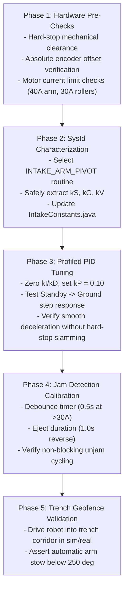

# Intake Arm Calibration & Tuning Guide — FRC Team 8334

Comprehensive engineering and tuning manual for the Articulated Ground Intake subsystem. This document guides programming and mechanical team members through hardware verification, SysId characterization, Profiled PID and ArmFeedforward calibration, stall jam detection, and trench safety geofencing.

---

## Scope

### What this document covers
- Architecture and control loops of [`Intake.java`](../src/main/java/frc/robot/Subsystems/Intake.java) and [`IntakeConstants.java`](../src/main/java/frc/robot/Subsystems/intake/IntakeConstants.java).
- Complete 5-phase physical tuning procedure for the physical intake arm and rollers.
- Runtime tuning workflows using Driver Station **Test Mode** ([`Test/IntakeTesting.java`](../src/main/java/frc/robot/Test/IntakeTesting.java)) and NetworkTables.
- Kinematic and feedforward calculations with [`tools/tune/calibrate_intake.py`](../tools/tune/calibrate_intake.py).
- Failure diagnosis and recovery matrix for arm motion, encoder drift, roller jams, and trench clearance.

### What this document does NOT cover
- Shooter flywheel tuning and ballistics (see [`docs/SHOOTER_TUNING_GUIDE.md`](SHOOTER_TUNING_GUIDE.md)).
- Swerve chassis navigation and obstacle avoidance (see [`ARCHITECTURE.md`](../ARCHITECTURE.md) §3A).

---

## Content

### 1. Subsystem Architecture & Mechanical Configuration

The Team 8334 intake features an articulated single-joint pivot arm paired with compliant ground rollers and a feeder hopper:

| Parameter | Specification | Code Location |
|---|---|---|
| **Pivot Motor** | 1x REV NEO Brushless (80:1 planetary + chain reduction) | [`IntakeIOSparkMax.java`](../src/main/java/frc/robot/Subsystems/intake/IntakeIOSparkMax.java) (CAN 21) |
| **Roller / Hopper** | 2x SparkMax (Rollers CAN 22, Hopper CAN 23) | [`IntakeConstants.java`](../src/main/java/frc/robot/Subsystems/intake/IntakeConstants.java) |
| **Absolute Encoder** | REV Through-Bore or SparkMax alternate encoder | [`IntakeConstants.INTAKE_POSITION_OFFSET`](../src/main/java/frc/robot/Subsystems/intake/IntakeConstants.java) (`276.0°`) |
| **Standby Angle** | $347.0^\circ$ (retracted inside frame perimeter) | [`IntakeConstants.INTAKE_UP_POSITION`](../src/main/java/frc/robot/Subsystems/intake/IntakeConstants.java) |
| **Ground Intake Angle** | $250.0^\circ$ (extended onto carpet) | [`IntakeConstants.INTAKE_DOWN_POSITION`](../src/main/java/frc/robot/Subsystems/intake/IntakeConstants.java) |
| **Horizontal Datum** | $250.0^\circ$ (perpendicular to gravity vector) | [`IntakeConstants.INTAKE_HORIZONTAL_POSITION`](../src/main/java/frc/robot/Subsystems/intake/IntakeConstants.java) |
| **Motion Limits** | Max Velocity $400^\circ/\text{s}$, Max Acceleration $400^\circ/\text{s}^2$ | [`IntakeConstants.MAX_ARM_VELOCITY`](../src/main/java/frc/robot/Subsystems/intake/IntakeConstants.java) |
| **Current Limits** | 40A continuous (arm pivot), 30A continuous (rollers/hopper) | [`IntakeIOSparkMax.java`](../src/main/java/frc/robot/Subsystems/intake/IntakeIOSparkMax.java) |

#### Control Law
Voltage commanded to the pivot motor is computed every 20ms:
$$\text{Arm Volts} = \text{ProfiledPIDController}(kP, kI, kD) + \text{ArmFeedforward}(kS, kG, kV, kA)$$

- **Gravity Torque Feedforward ($kG$):**
  $$\tau_g(\theta) = kG \cdot \cos(\theta - \theta_{\text{horizontal}})$$
  Since horizontal datum is calibrated at $250.0^\circ$, peak gravity torque occurs at ground deployment ($250^\circ$), where $\cos(0^\circ) = 1.0$.
- **Trapezoidal Motion Profiling:** WPILib `ProfiledPIDController` smoothly bounds velocity and acceleration to avoid dynamic tipping or chain whipping.
- **Continuous Wrapping:** `enableContinuousInput(0, 360)` prevents winding cables if crossing $0^\circ/360^\circ$.
- **Geofenced Low-Ceiling Trench Protection:** In [`Intake.java:177-188`](../src/main/java/frc/robot/Subsystems/Intake.java#L177-L188), if swerve odometry detects the robot is inside a trench low-clearance tunnel, the arm goal is automatically clamped down to $\le 250^\circ$ to prevent colliding with the 2026 field low bar.

---

### 2. NetworkTables & Live Tuning Keys

| NetworkTables Key | Type | Description | Default |
|---|---|---|---|
| `/SmartDashboard/Intake/kArmP` | double | Proportional feedback gain (V/deg error) | `0.10` |
| `/SmartDashboard/Intake/kArmI` | double | Integral feedback gain | `0.0` |
| `/SmartDashboard/Intake/kArmD` | double | Derivative feedback gain (V/(deg/s) error) | `0.01` |
| `/SmartDashboard/Intake/kArmS` | double | Static friction feedforward (V) | `0.20` |
| `/SmartDashboard/Intake/kArmG` | double | Gravity compensation feedforward (V at horizontal) | `0.34` |
| `/SmartDashboard/Intake/kArmV` | double | Velocity feedforward (V / (deg/s)) | `0.0` |
| `/SmartDashboard/Intake/kArmA` | double | Acceleration feedforward (V / (deg/s²)) | `0.0` |
| `/SmartDashboard/Intake/ArmPosition` | double | Current arm angle (deg) | Live |
| `/SmartDashboard/Intake/ArmTarget` | double | Current profiled goal angle (deg) | Live |
| `/SmartDashboard/Intake/RollerCurrent`| double | Measured roller current draw (A) | Live |
| `/SmartDashboard/Intake/TrenchSafetyClamped` | boolean | Indicates whether trench ceiling safety override is active | Live |

---

### 3. Step-by-Step Tuning Procedure



#### Phase 1: Hardware Pre-Checks
1. **Mechanical Clearance:** Move arm by hand through full mechanical travel ($245^\circ$ to $350^\circ$). Ensure wiring harness, pneumatic tubing, and chain have adequate slack.
2. **Absolute Encoder Calibration:**
   - Place arm against mechanical Standby ($347.0^\circ$). Read raw encoder value.
   - Adjust `INTAKE_POSITION_OFFSET` in [`IntakeConstants.java`](../src/main/java/frc/robot/Subsystems/intake/IntakeConstants.java) so `/SmartDashboard/Intake/ArmPosition` matches actual physical angle.
3. **Current Limits:** Verify 40A smart current limit on arm SparkMax and 30A on rollers.

#### Phase 2: SysId Characterization ($kS, kG, kV$)
1. **Enable Test Mode:**
   - Set TestMode category to `SYSID_CHARACTERIZATION` (`LB + D-Pad Up`).
   - On SmartDashboard, set `Test/SysId/SelectMechanism` to `INTAKE_ARM_PIVOT`.
2. **Execute Characterization:**
   - `SysIdManager` configures the arm routine with safe conservative limits: ramp rate **$0.75\text{ V/s}$** and step voltage **$3.5\text{ V}$** (5.0s timeout) to prevent driving through hard stops.
   - Hold Driver **A** for Quasistatic Forward until arm sweeps upwards.
   - Hold Driver **B** for Quasistatic Reverse.
   - Hold Driver **X** for Dynamic Forward.
3. **Analyze Results:**
   - Theoretical estimates via CLI:
     ```powershell
     python tools/tune/calibrate_intake.py --sysid-estimate
     ```
   - **$kS$ (Static Friction):** $0.15\text{ V} - 0.30\text{ V}$.
   - **$kG$ (Gravity Gain):** $0.34\text{ V} - 0.85\text{ V}$ (varies with arm mass and center of gravity).
   - Update `INTAKE_ARM_KS_VAL` and `INTAKE_ARM_KG_VAL` in [`IntakeConstants.java`](../src/main/java/frc/robot/Subsystems/intake/IntakeConstants.java).

#### Phase 3: Profiled PID Feedback Tuning
1. **Set Initial Feedback Gains:**
   - Start with $kP = 0.10\text{ V/deg}$, $kI = 0.0$, $kD = 0.01\text{ V/(deg/s)}$.
2. **Test Mode Operation:**
   - Switch to `INTAKE_TESTING` category (`LB + D-Pad Left`).
   - Use Operator D-pad: `POV 0` (Standby $347^\circ$), `POV 180` (Ground $250^\circ$).
   - Pull Operator **Right Trigger** (> 0.5) to execute transition.
3. **Kinematics Verification:**
   - Theoretical transit duration calculated by `calibrate_intake.py --profile` is **$0.985\text{ s}$** (triangular profile reaching $197^\circ/\text{s}$ peak velocity).
   - If arm overshoots when approaching Ground ($250^\circ$), increase $kD$ to $0.02$.
   - If arm struggles to lift off the carpet from Ground, increase $kG$ by $+0.05\text{ V}$ or $kP$ to $0.12$.

#### Phase 4: Jam Detection & Automated Unjamming
1. In `TestMode` $\rightarrow$ `JAM_DETECTION` (Driver **Y** button), run rollers under load.
2. If rollers stall ($> 30\text{ A}$ continuous for $> 0.5\text{ s}$ debounced), verify:
   - System auto-reverses rollers at $-0.7$ power for $1.0\text{ s}$.
   - Main robot loop remains completely responsive (no blocking `Timer.delay`).
   - Elastic dashboard displays `Roller Jam Detected: Auto-Clearing` warning alert.

#### Phase 5: Trench Geofence Verification
1. Drive the robot toward the Trench corridor in simulation or on field.
2. With arm deployed in Standby ($347^\circ$), enter the low-clearance zone ($Y \le 1.55\text{ m}$ or $Y \ge 6.50\text{ m}$).
3. Verify `/SmartDashboard/Intake/TrenchSafetyClamped` switches to `true` and the arm automatically moves down to horizontal ($250^\circ$) to clear the low bar.

---

## Verification

- **Verified against:** Commit `6a13ca0` (2026-10-06).
- **Test Suite Status:** 47 test files / 461 tests green (`BUILD SUCCESSFUL in 11s`).
- **Unit Tests:** [`IntakeTestingTest.java`](../src/test/java/frc/robot/Test/IntakeTestingTest.java) (`testIntakeTestingLifecycle`, `testIntakeArmSetpointsValid`).
- **Tool Verification:** `calibrate_intake.py` verified across `--sysid-estimate` and `--profile` modes.
- **Next Review Due:** 2026-11-05.

---

## Related

- Subsystem implementation: [`Subsystems/Intake.java`](../src/main/java/frc/robot/Subsystems/Intake.java)
- Constants & geometry: [`Subsystems/intake/IntakeConstants.java`](../src/main/java/frc/robot/Subsystems/intake/IntakeConstants.java)
- Test Mode interface: [`Test/IntakeTesting.java`](../src/main/java/frc/robot/Test/IntakeTesting.java)
- Master documentation index: [`docs/INDEX.md`](INDEX.md)
