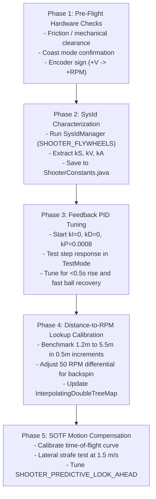

# Shooter Calibration & Tuning Guide — FRC Team 8334

Comprehensive engineering and tuning manual for the dual-flywheel shooter subsystem. This document guides programming and drive team members through hardware verification, SysId characterization, closed-loop PID tuning, empirical distance-to-RPM calibration, Shooting-On-The-Fly (SOTF) compensation, and automation tooling.

---

## Scope

### What this document covers
- Architecture and control loops of [`Shooter.java`](../src/main/java/frc/robot/Subsystems/Shooter.java) and [`ShooterConstants.java`](../src/main/java/frc/robot/Data/Constants.java).
- Complete 5-phase physical tuning procedure for the physical robot.
- Runtime tuning workflows using Driver Station **Test Mode** ([`Test/ShooterTuning.java`](../src/main/java/frc/robot/Test/ShooterTuning.java)) and NetworkTables.
- Offline and live ballistics calibration with [`tools/tune/calibrate_shooter.py`](../tools/tune/calibrate_shooter.py).
- Failure diagnosis and recovery matrix for flywheel, kicker, and targeting issues.

### What this document does NOT cover
- AprilTag vision pipeline and camera latency calibration (see [`ARCHITECTURE.md`](../ARCHITECTURE.md) §3D).
- Swerve drive odometry and kinematics tuning (see [`docs/COORDINATION.md`](COORDINATION.md) and [`src/main/java/frc/robot/Test/README.md`](../src/main/java/frc/robot/Test/README.md)).
- Autonomous path generation (see [`OPERATORS_GUIDE.md`](../OPERATORS_GUIDE.md)).

---

## Content

### 1. Subsystem Architecture & Hardware Parameters

The Team 8334 shooter features independent dual flywheels with a fixed 70° hood and a dedicated kicker wheel:

| Parameter | Specification | Code Location |
|---|---|---|
| **Motors** | 2x REV NEO Brushless (1:1 direct or belted to wheels) | [`Shooter.java`](../src/main/java/frc/robot/Subsystems/Shooter.java) (CAN 11 Right, CAN 12 Left) |
| **Kicker Motor** | 1x REV NEO 550 or SparkMax feeder | CAN 13 ([`ShooterConstants.KICKER_CAN_ID`](../src/main/java/frc/robot/Data/Constants.java)) |
| **Wheel Diameter** | 4.0 inches ($0.1016\text{ m}$) compliant wheels | [`calibrate_shooter.py`](../tools/tune/calibrate_shooter.py) |
| **Hood Geometry** | Fixed $70.0^\circ$ angle | [`ShooterConstants.HOOD_ANGLE_DEGREES`](../src/main/java/frc/robot/Data/Constants.java) |
| **Release Height** | $0.53\text{ m}$ from carpet floor | [`calibrate_shooter.py`](../tools/tune/calibrate_shooter.py) |
| **Target Aperture** | $1.48\text{ m}$ (funnel center) / $1.8288\text{ m}$ (rim top) | [`FieldMap.java`](../src/main/java/frc/robot/Navigation/FieldMap.java) |
| **Differential Spin** | Right flywheel +50 RPM faster than Left (backspin) | [`Shooter.java:140-154`](../src/main/java/frc/robot/Subsystems/Shooter.java#L140-L154) |
| **Current Limits** | 40A continuous (flywheels), 30A continuous (kicker) | [`NeoSparkMaxMotor.java`](../src/main/java/frc/robot/Hardware/NeoSparkMaxMotor.java) |
| **Idle Mode** | `CANSparkMax.IdleMode.kCoast` (mandatory) | Subsystem hardware configuration |

#### Control Law
Voltage commanded to each flywheel is calculated every 20ms:
$$\text{Output Volts} = \text{Feedforward}(kS, kV, kA) + \text{Feedback}(kP, kI, kD)$$

- **Feedforward:** WPILib `SimpleMotorFeedforward(kS, kV, kA)` in units of Volts, Volts per RPM, and Volts per $(\text{RPM/s})$.
- **Feedback:** WPILib `PIDController(kP, kI, kD)` with anti-windup clamping on the integral accumulator constrained to $[-1.5, 1.5]\text{ V}$.
- **Speed Tolerance:** Flywheels must be within $\pm 150\text{ RPM}$ of target for `isAtCorrectSpeed()` to engage, with a $750\text{ RPM}$ drop-out hysteresis.
- **Heading Tolerance:** Target azimuth angle error must be $< 3.0^\circ$ for `isReadyToFire()` to engage.
- **Alliance Zone Gate:** Firing is strictly prohibited outside the Alliance Zone ($X \le 4.6256\text{ m}$ Blue, $X \ge 11.9154\text{ m}$ Red) per [`FieldMap.AllianceZones`](../src/main/java/frc/robot/Navigation/FieldMap.java).

---

### 2. NetworkTables & Elastic Dashboard Keys

When `Constants.TUNING_MODE = true`, all shooter constants can be inspected and tuned live:

| NetworkTables Key | Type | Description | Default |
|---|---|---|---|
| `/TunableNumbers/Shooter/kP` | double | Proportional feedback gain (V/RPM error) | `0.0008` |
| `/TunableNumbers/Shooter/kI` | double | Integral feedback gain (with $[-1.5, 1.5]\text{ V}$ accumulator clamp) | `0.0` |
| `/TunableNumbers/Shooter/kD` | double | Derivative feedback gain | `0.0` |
| `/TunableNumbers/Shooter/kS` | double | Static friction feedforward (V) | `0.15` |
| `/TunableNumbers/Shooter/kV` | double | Velocity feedforward (V/RPM) | `0.0022` |
| `/TunableNumbers/Shooter/kA` | double | Acceleration feedforward ($\text{V}/(\text{RPM/s})$) | `0.0005` |
| `/SmartDashboard/Shooter/FlywheelLeftRPM` | double | Actual Left flywheel RPM (measured by NEO hall sensor) | Live |
| `/SmartDashboard/Shooter/FlywheelRightRPM` | double | Actual Right flywheel RPM (measured by NEO hall sensor) | Live |
| `/SmartDashboard/Shooter/TargetRPM` | double | Commanded base target RPM | Live |
| `/SmartDashboard/Shooter/IsAtSpeed` | boolean | Indicates whether both flywheels are within $\pm 150\text{ RPM}$ | Live |
| `/SmartDashboard/Shooter/ReadyToFire` | boolean | Indicates speed acquired + azimuth aligned ($< 3^\circ$) + inside Alliance Zone | Live |
| `/SmartDashboard/Test/Shooter/TestVelocity` | double | TestMode manual setpoint RPM (controlled by trigger or presets) | `3000.0` |
| `/SmartDashboard/Test/Shooter/TestDistance` | double | TestMode auto-aim distance (meters) | `3.0` |

---

### 3. Step-by-Step Tuning Procedure



#### Phase 1: Hardware Pre-Checks
1. **Mechanical Clearance:** Spin both flywheels and the kicker wheel by hand. Verify no contact with the 70° curved polycarbonate backing or aluminum side plates.
2. **Idle Mode:** Verify both flywheel SparkMax controllers are in **`kCoast` mode**. 
   > [!CAUTION]
   > Setting flywheel controllers to `kBrake` mode causes severe belt and gear train stress upon motor shutdown. Never configure flywheels in brake mode.
3. **Current Limits:** Ensure 40A smart current limits are applied.
4. **Sensor Polarity Check:**
   - Command +1.0V open-loop.
   - Confirm `/SmartDashboard/Shooter/FlywheelLeftRPM` and `FlywheelRightRPM` report **positive RPM**.
   - If a motor spins backwards or reads negative, correct motor inversion in [`ShooterIOSparkMax.java`](../src/main/java/frc/robot/Subsystems/ShooterIOSparkMax.java).

#### Phase 2: SysId Characterization ($kS, kV, kA$)
1. **Enable Test Mode:**
   - Power on the robot, connect Driver Station, and enable **Test Mode**.
   - Category selector: select `SYSID_CHARACTERIZATION` (default) or use Driver controller `LB + D-Pad Up`.
   - On SmartDashboard, set `Test/SysId/SelectMechanism` to `SHOOTER_FLYWHEELS`.
2. **Execute Characterization Routines:**
   - Hold Driver **A** button for **Quasistatic Forward** (ramps from 0 to 12V at 0.5 V/s until full speed). Release immediately at 12V.
   - Hold Driver **B** button for **Quasistatic Reverse** (or single-direction if mechanism is unidirectional).
   - Hold Driver **X** button for **Dynamic Forward** (steps to 7.0V to capture flywheel rotational inertia $J$).
3. **Analyze & Extract Gains:**
   - Open AdvantageScope $\rightarrow$ SysId tab, or run the theoretical model:
     ```powershell
     python tools/tune/calibrate_shooter.py --sysid-estimate
     ```
   - **$kS$ (Static Friction):** $0.10\text{ V} - 0.25\text{ V}$.
   - **$kV$ (Velocity Gain):** $\frac{12.0\text{ V}}{5676\text{ RPM}} \approx 0.002114\text{ V/RPM}$ (typical measured: $0.0022$).
   - **$kA$ (Acceleration Gain):** $0.0003 - 0.0008\text{ V}/(\text{RPM/s})$.
4. Update `FLYWHEEL_KS`, `FLYWHEEL_KV`, and `FLYWHEEL_KA` in [`Constants.java`](../src/main/java/frc/robot/Data/Constants.java).

#### Phase 3: Closed-Loop Feedback PID Tuning ($kP, kI, kD$)
Because feedforward supplies $\approx 95\%$ of the steady-state operating voltage, feedback is used primarily for fast disturbance rejection (battery sag and ball compression drag).

1. **Initial Gains:** Set $kI = 0.0$, $kD = 0.0$, $kP = 0.0008\text{ V/RPM}$.
2. **Switch to Shooter Tuning:**
   - On Driver controller, press `LB + D-Pad Down` to switch TestMode category to `SHOOTER_TUNING`.
   - Press **Y** button to activate **PID Tuning Mode**.
3. **Command Step Response:**
   - Pull Driver **Right Trigger** (> 0.5) to spin up to test target ($3000\text{ RPM}$).
   - Observe velocity curve in AdvantageScope:
     - **Rise Time:** Must reach setpoint within $< 0.5\text{ seconds}$.
     - **Overshoot:** Should not exceed $+50\text{ RPM}$. If oscillation occurs, reduce $kP$ by $20\%$.
4. **Ball Dip Rejection Test:**
   - While flywheels hold $3500\text{ RPM}$, press Operator **Right Bumper** to feed a ball through the kicker.
   - The ball will cause a momentary speed drop of $150 - 300\text{ RPM}$.
   - **Recovery Window:** The PID controller must pull the flywheels back into the $\pm 150\text{ RPM}$ tolerance band in **$< 0.15\text{ seconds}$**.
   - If recovery is sluggish, incrementally increase $kP$ (up to $0.0012$).
   - Leave $kI = 0.0$. If a small steady-state offset remains under load, add $kI = 0.00005$; the hard anti-windup clamp in [`Shooter.java:134-135`](../src/main/java/frc/robot/Subsystems/Shooter.java#L134-L135) ($[-1.5, 1.5]\text{ V}$) prevents runaway accumulation.

#### Phase 4: Distance-to-RPM Lookup Table Calibration
1. **Setup Calibration Marks:**
   Mark carpet distances measured horizontally from the Hub rim center:
   $1.2\text{ m}$, $2.0\text{ m}$, $2.5\text{ m}$, $3.0\text{ m}$, $3.5\text{ m}$, $4.0\text{ m}$, $5.0\text{ m}$.
2. **Station Test Protocol:**
   - Position the robot bumper at the designated distance, facing the Hub within the Alliance Zone.
   - In `ShooterTuning`, use Operator D-pad presets (`POV 0` = 4500 RPM, `POV 90` = 3500 RPM, `POV 180` = 2500 RPM, `POV 270` = 1000 RPM) or manual trigger control to find the RPM that lands balls in the center of the inner funnel.
   - Fire a 5-ball cluster at each distance.
   - Maintain the standard **50 RPM differential** (Right wheel = Base + 25 RPM, Left wheel = Base - 25 RPM).
   - If balls flutter or trajectory spreads laterally, increase the differential to **75 RPM** to increase gyroscopic backspin stability.
3. **Verify Against Theory:**
   Compare your field results against theoretical ballistics:
   ```powershell
   python tools/tune/calibrate_shooter.py --compare
   ```
4. **Generate Java Code:**
   Use the tool to generate code ready for [`Shooter.java`](../src/main/java/frc/robot/Subsystems/Shooter.java#L80-L105):
   ```powershell
   python tools/tune/calibrate_shooter.py --generate --efficiency 0.42 --spin-diff 50
   ```

#### Phase 5: Shooting On The Fly (SOTF) Dynamic Motion Compensation
When the robot translates while shooting, the ball inherits the chassis velocity vector $\vec{v}_{\text{robot}}$. The software compensates by shooting at a virtual target point:
$$\vec{r}_{\text{virtual}} = \vec{r}_{\text{hub}} - \vec{v}_{\text{robot}} \cdot t_{\text{flight}}$$

1. **Verify Flight Time Modeling:**
   [`Shooter.java:248`](../src/main/java/frc/robot/Subsystems/Shooter.java#L248) models time-of-flight as:
   $$t_{\text{flight}} = 0.12 + 0.18 \cdot \text{distance}$$
2. **Lateral Strafe Test:**
   - In Teleop, drive sideways at $1.5\text{ m/s}$ across the Alliance Zone while holding the Glide/Auto-Aim trigger.
   - **If shots lag behind the Hub** (miss in the direction opposite to motion): Increase `SHOOTER_PREDICTIVE_LOOK_AHEAD` from $0.050\text{ s}$ to $0.070\text{ s}$.
   - **If shots lead the Hub too far** (overcompensating): Decrease `SHOOTER_PREDICTIVE_LOOK_AHEAD` to $0.035\text{ s}$.

---

### 4. Calibration Automation Tool (`calibrate_shooter.py`)

The repository includes a dedicated CLI calibration script located at [`tools/tune/calibrate_shooter.py`](../tools/tune/calibrate_shooter.py).

#### Common Commands

| Command | Action | Output Description |
|---|---|---|
| `python tools/tune/calibrate_shooter.py --compare` | Validates table against 2D ballistics | Compares production RPM table vs theoretical exit velocity, RPM difference, and flight time. |
| `python tools/tune/calibrate_shooter.py --calc-rpm 3.25` | Single-distance analytical solver | Computes required exit velocity, time-of-flight, and left/right RPM for a specific distance ($3.25\text{ m}$). |
| `python tools/tune/calibrate_shooter.py --sysid-estimate` | Feedforward gain estimator | Displays theoretical $kS, kV, kA$ and recommended initial $kP$ based on REV NEO constants. |
| `python tools/tune/calibrate_shooter.py --generate` | Java code generator | Outputs formatted Java lines for `leftRpmTable.put(...)` and `rightRpmTable.put(...)`. |
| `python tools/tune/calibrate_shooter.py --generate --efficiency 0.40 --spin-diff 60` | Custom parameter generator | Generates table with custom energy transfer efficiency ($40\%$) and differential ($60\text{ RPM}$). |

---

### 5. Troubleshooting & Diagnostics Matrix

| Symptom | Probable Cause | Corrective Action |
|---|---|---|
| **Flywheels oscillate or hunt (audible pulsing)** | Feedback gain $kP$ is too high; derivative kick | Reduce $kP$ by $25\%$. Ensure $kD = 0.0$. |
| **Severe RPM drop upon ball contact (> 400 RPM dip)** | Feedforward $kV$ too low or $kP$ too low; kicker stalling | Increase $kP$ to $0.0010$. Check kicker current and roller belt tension. |
| **Kicker pulses but balls don't shoot** | `isAtCorrectSpeed()` or `isReadyToFire()` gate unsatisfied | Check RPM error in AdvantageScope. Verify azimuth heading error is $< 3.0^\circ$. |
| **Shooter refuses to spin up in Teleop** | Robot is outside the Alliance Zone | Shooter is locked out when $X > 4.6256\text{ m}$ (Blue) or $X < 11.9154\text{ m}$ (Red). Drive into zone. |
| **TestMode trigger does not spin flywheels** | State machine not transitioned | Verify code has `prepareToShoot()` or `shoot()` called prior to `setTargetRPM()`. |
| **Balls miss high/low at specific distances** | Interpolating table entries need trimming | Adjust entry at that distance in `leftRpmTable` / `rightRpmTable` in increments of $\pm 50\text{ RPM}$. |
| **Flywheel draws > 40A while idling at setpoint** | Mechanical binding or motor fighting inversion | Disconnect belts and verify free rotation. Ensure left and right motors are not fighting each other. |

---

## Verification

- **Verified against:** Commit `6a13ca0` (2026-10-06).
- **Test Suite Status:** 46 test files / 459 tests green (`BUILD SUCCESSFUL in 12s`).
- **Specific Tests:** [`ShooterTuningTest.java`](../src/test/java/frc/robot/Test/ShooterTuningTest.java) (`testUpdatePIDGainsAppliesDirectly`, `testShooterTuningLifecycle`).
- **Tool Verification:** `calibrate_shooter.py` execution verified clean across all 4 operational CLI modes.
- **Next Review Due:** 2026-11-05.

---

## Related

- Subsystem implementation: [`Subsystems/Shooter.java`](../src/main/java/frc/robot/Subsystems/Shooter.java)
- Constants & geometry: [`Data/Constants.java`](../src/main/java/frc/robot/Data/Constants.java)
- Test Mode controller interface: [`Test/ShooterTuning.java`](../src/main/java/frc/robot/Test/ShooterTuning.java)
- Architecture contracts: [`ARCHITECTURE.md`](../ARCHITECTURE.md) §3B
- Operator controls: [`OPERATORS_GUIDE.md`](../OPERATORS_GUIDE.md)
- Test harness overview: [`src/main/java/frc/robot/Test/README.md`](../src/main/java/frc/robot/Test/README.md)
- Master documentation index: [`docs/INDEX.md`](INDEX.md)
